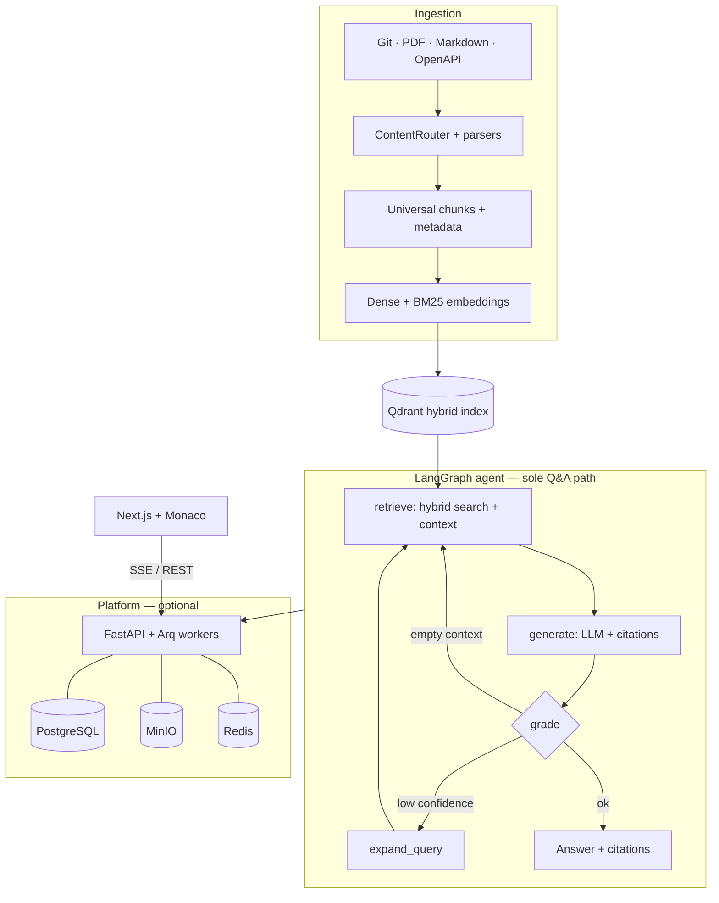
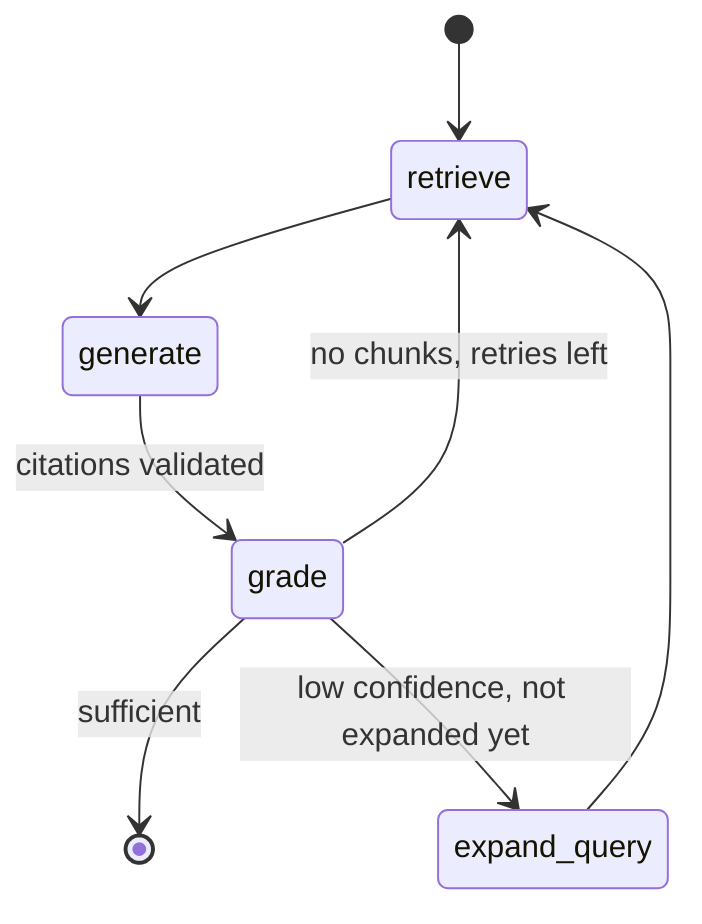
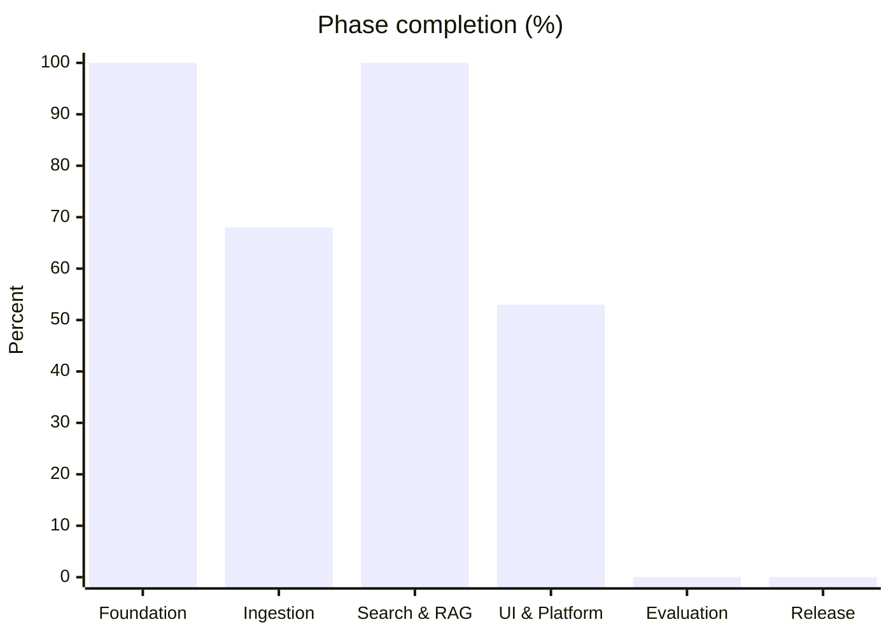

<div align="center">

# Drishti — दृष्टि

**Multi-modal, AST-aware RAG System for Code & Document Understanding**

*Sanskrit: "vision" or "sight" — see through your entire codebase*

[](https://python.org)
[](https://fastapi.tiangolo.com)
[](https://qdrant.tech)
[](https://tree-sitter.github.io)
[](LICENSE)
[](https://github.com/Abhishekkumar2021/Drishti/actions)

</div>

---

## What Is Drishti?

Drishti is a **retrieval-augmented generation (RAG) system** that understands codebases and documentation at a structural level. Unlike naive RAG that splits text by character count, Drishti uses **Tree-sitter** to parse code into its Abstract Syntax Tree (AST), creating semantically meaningful chunks — complete functions, classes, interfaces — not random fragments.

It also ingests PDFs, Markdown docs, diagrams, and API specs, enabling **cross-modal queries** like:

> *"Where is authentication handled?"*
> → Returns code from `AuthService.java`, quotes from the design spec PDF, and descriptions of the auth sequence diagram — all in one answer with file paths and line numbers.

> **Important distinction:** Drishti is a **knowledge retrieval system**, not a code generator. You ask questions about existing code and docs; Drishti finds, explains, and cites the relevant pieces.

### Why AST-Aware RAG?

| Approach | How It Chunks Code | Search Results | Quality |
|----------|-------------------|----------------|---------|
| **Naive RAG** | Split every 500 characters | Random fragments: half a function here, part of a class there | ❌ Poor |
| **Line-based** | Split every 50 lines | Arbitrary boundaries, loses context | ❌ Poor |
| **Drishti (AST-aware)** | Parse via Tree-sitter → extract complete functions, classes, interfaces | Whole functions with metadata: name, parameters, return type, parent class, dependencies | ✅ Excellent |

---

## Architecture Overview

### End-to-end flow



### LangGraph agent graph



Registered **LangChain tools** (for future tool-calling nodes): `hybrid_search`, `read_source`, `ingest_status`. With `DATABASE_URL` set, conversation `thread_id` persists via **Postgres checkpointer**.

Further reading: [Platform V2](docs/architecture/platform-v2-agentic.md) · [C4 model](docs/architecture/c4-model.md) · [Sequence diagrams](docs/architecture/sequence-diagrams.md)

---

## Features

| Feature | Description | Status |
|---------|-------------|--------|
| **AST-Aware Chunking** | Tree-sitter parses code into functions, classes, interfaces | 🟩 Implemented |
| **Multi-Language** | Python, Java, JavaScript/TypeScript, Go | 🟩 Implemented |
| **Parser rule engine** | JSON-driven queries + `min_chunk_lines` | 🟩 Implemented |
| **Chunk metadata** | Docstrings, params, complexity, context paths | 🟩 Implemented |
| **Incremental git indexing** | Diff-based re-index via `IncrementalIndexer` | 🟩 Implemented |
| **Markdown ingestion** | Header-hierarchy chunks (`.md`, `.mdx`) | 🟩 Implemented |
| **PDF Ingestion** | Layout-aware parsing: text blocks, tables | 🟩 Implemented |
| **OpenAPI ingestion** | Per-endpoint chunks from OpenAPI/Swagger specs | 🟩 Implemented |
| **PDF diagram vision** | Claude Vision for images in PDFs | 🔮 Planned |
| **Hybrid Search** | BM25 + dense vectors, RRF fusion (`HybridSearchPipeline`) | 🟩 Implemented |
| **Re-ranking** | Cohere rerank or lexical fallback (configurable) | 🟩 Implemented |
| **Provider-agnostic models** | Any embedding/LLM via `EMBEDDING_PROVIDER`, `LLM_PROVIDER` | 🟩 Implemented |
| **Cross-Modal Q&A** | Scoped search over code + docs in a workspace/repo | 🟩 Implemented |
| **Streaming Answers** | SSE: `token`, `context`, `citation`, `done` | 🟩 Implemented |
| **Workspaces & uploads** | Platform APIs, artifact ingest, git snapshots | 🟩 Implemented |
| **PostgreSQL / MinIO** | Optional SoR + object storage | 🟩 Implemented |
| **LangGraph agent** | Retrieve → generate → grade; `expand_query` retry | 🟩 Implemented |
| **Agent tools** | `hybrid_search`, `read_source`, `ingest_status` | 🟩 Implemented |
| **Postgres checkpointer** | LangGraph state per conversation | 🟩 Implemented |
| **SSE via graph** | `astream_events` (US-14.04) | 🟨 Planned |
| **Impact Analysis** | Neo4j + `graph_impact` tool (EPIC-09) | 🔮 Planned |
| **Code navigation UI** | Citation → Monaco + `/source/read` | 🟩 Implemented |
| **RAG Evaluation** | RAGAS golden set in CI (EPIC-11) | 🔮 Planned |

---

## Tech Stack

| Component | Technology | Why |
|-----------|-----------|-----|
| **Runtime** | Python 3.12 | Best ML/AI ecosystem |
| **Web Framework** | FastAPI | Async, auto-docs, Pydantic native |
| **AST Parsing** | Tree-sitter | Multi-language, incremental, fast |
| **Embeddings** | OpenAI (default), Cohere, Ollama, OpenAI-compatible | `EMBEDDING_PROVIDER` |
| **Vector DB** | Qdrant | Native hybrid search (dense+sparse) |
| **Re-ranking** | Cohere (default) or lexical | `RERANK_PROVIDER` |
| **LLM** | Anthropic (default), OpenAI, Ollama | `LLM_PROVIDER` |
| **PDF Parsing** | PyMuPDF | Layout-aware, tables, images |
| **Graph DB** | Neo4j (optional) | Dependency graph traversal |
| **Cache** | Redis | Query result caching |
| **System of record** | PostgreSQL (optional) | Workspaces, conversations, jobs |
| **Object storage** | MinIO (optional) | Durable artifact uploads |
| **Agent** | LangGraph + langchain-core tools | Checkpointer + grade / expand loop |
| **Workers** | Arq + Redis | Background ingest jobs |
| **Observability** | structlog (JSON logs) | Request correlation, production logs |
| **Frontend** | Next.js 14 + Monaco | Code highlighting, navigation |

---

## What Drishti Is NOT

- Not an IDE or code editor — it's a knowledge retrieval system
- Not a code generation tool — it *finds* and *explains* existing code
- Not a replacement for documentation — it makes documentation *searchable*
- Not a CI/CD tool — it's for understanding, not deployment

---

## Quick Start

### Prerequisites

- **Python 3.12+**
- **Docker** (for Qdrant and Redis)
- **API Keys**: Depends on providers chosen (see [Model providers](docs/design/model-providers.md)); defaults use OpenAI + Anthropic + Cohere

### Setup

```bash
# Clone the repository
git clone https://github.com/Abhishekkumar2021/Drishti.git
cd Drishti

# First-time setup (installs uv, creates venv, installs deps)
make setup

# Configure API keys
cp .env.example .env
# Edit .env with your API keys

# Start infrastructure (Qdrant, Redis, Postgres, MinIO, Ollama)
make docker-up

# Optional: enable production platform in .env
#   DATABASE_URL=postgresql+asyncpg://drishti@localhost:5432/drishti
#   ENABLE_MINIO=true
#   make db-migrate

# One-shot local stack (infra + migrate + API)
make dev-ready

# Or step-by-step:
make docker-up
# With DATABASE_URL in .env:
make db-migrate
make dev          # API — http://localhost:8000/docs
make worker       # optional Arq ingest worker
```

### Build and Test

```bash
make test
make lint
make type-check
make ci-precheck  # lint + tests (CI parity)
make pre-commit

# Run RAG evaluation benchmarks
make benchmark
```

---

## Repository Layout

```
Drishti/
├── README.md                          # You are here
├── AGENTS.md                          # AI coding assistant guidelines
├── CONTRIBUTING.md                    # Contribution guide
├── CHANGELOG.md                       # Version history
├── docs/
│   ├── README.md                      # Documentation index
│   ├── IMPLEMENTATION_STATUS.md       # What's built vs. planned
│   ├── architecture/                  # High-level architecture
│   ├── adr/                           # Architecture Decision Records (13)
│   ├── rfc/                           # Request for Comments
│   ├── lld/                           # Low-Level Design docs (5)
│   ├── product/                       # Vision, epics (01–17), release plan
│   ├── design/                        # API contracts, model providers
│   ├── evaluation/                    # RAG metrics & baselines
│   ├── deep-dives/                    # Technical deep-dives (5 chapters)
│   └── model-card.md                  # AI model documentation
├── src/drishti/                       # Python package
│   ├── ingestion/                     # AST + PDF + Markdown parsers
│   ├── embedding/                     # Dense + sparse embeddings
│   ├── storage/                       # Qdrant + Neo4j stores
│   ├── search/                        # Hybrid search + RRF + rerank
│   ├── generation/                    # Context + citations (agent uses RAG prep)
│   ├── agent/                         # LangGraph graph, nodes, tools, checkpointer
│   ├── db/                            # SQLAlchemy models + session
│   ├── services/                      # Platform, ingest, conversation stores
│   ├── worker/                        # Arq background jobs
│   ├── observability/                 # Structured logging
│   ├── api/                           # REST routes (core + platform)
│   └── utils/                         # Language detection, git utils
├── tests/                             # Unit, integration, e2e tests
├── benchmarks/                        # RAG evaluation scripts
├── notebooks/                         # Jupyter tutorials
├── playground/                        # Standalone learning modules
├── web/                               # Next.js frontend (Phase 4)
└── scripts/                           # Setup, seed, pre-commit
```

---

## Documentation

### Implementation & Product

| Document | Description |
|----------|-------------|
| **[Implementation Status](docs/IMPLEMENTATION_STATUS.md)** | **What is built in this repo (update with each feature)** |
| [Product Vision](docs/product/PRODUCT-VISION.md) | Mission, users, differentiators |
| [Epics Overview](docs/product/EPICS-OVERVIEW.md) | Epics 01–17, user stories |
| [Platform V2](docs/architecture/platform-v2-agentic.md) | LangGraph, Postgres, MinIO, delivery plan |
| [Release Plan](docs/product/releases/RELEASE-PLAN.md) | Alpha → Beta → v1.0 roadmap |

### Architecture & Design

| Document | Description |
|----------|-------------|
| [Documentation Hub](docs/README.md) | Master index — start here |
| [Architecture Hub](docs/architecture/README.md) | C4, sequences, deployment, as-built ingestion |
| [C4 Model](docs/architecture/c4-model.md) | Context / container / component diagrams |
| [High-Level Architecture](docs/architecture/high-level-architecture.md) | Target system design |
| [As-Built Ingestion](docs/architecture/as-built-code-ingestion.md) | Implemented Tree-sitter pipeline |
| [Universal Chunk Schema](docs/design/universal-chunk-schema.md) | Chunk fields + ER diagram |
| [ADR Index](docs/adr/README.md) | 13 Architecture Decision Records |
| [API Contracts](docs/design/api-contracts.md) | REST API + WebSocket specs |
| [Model Providers](docs/design/model-providers.md) | Embedding, LLM, rerank configuration |
| [LLD Index](docs/lld/README.md) | Design patterns, data models, search pipeline |
| [Onboarding](docs/onboarding/README.md) | 30-minute contributor path |
| [Operations Runbook](docs/operations/README.md) | CI, health checks, troubleshooting |

### Deep-Dives (Interview-Ready)

| Chapter | Topic | Priority |
|---------|-------|----------|
| [01](docs/deep-dives/01-tree-sitter-internals.md) | Tree-sitter Internals & AST Parsing | ⭐⭐⭐ |
| [02](docs/deep-dives/02-embedding-models-compared.md) | Embedding Models for Code | ⭐⭐ |
| [03](docs/deep-dives/03-hybrid-search-mechanics.md) | Hybrid Search & RRF Mechanics | ⭐⭐⭐ |
| [04](docs/deep-dives/04-pdf-layout-analysis.md) | PDF Layout Analysis | ⭐⭐ |
| [05](docs/deep-dives/05-rag-evaluation-science.md) | RAG Evaluation Science | ⭐⭐⭐ |

### Evaluation

| Document | Description |
|----------|-------------|
| [Evaluation README](docs/evaluation/README.md) | Methodology overview |
| [Metrics](docs/evaluation/metrics.md) | RAGAS metric definitions |
| [Baseline](docs/evaluation/baseline.md) | Naive vs. AST chunking comparison |

---

## Project Status

**~70% overall** (322 / 461 story points). Platform V2 epics 13–17 are in progress on `develop`.



| Area | Status |
|------|--------|
| Documentation, CI, Docker | Complete |
| Code + document ingestion (EPIC-03–05) | Ingestion ~68%; code path complete |
| Hybrid search + RAG prep (EPIC-06–07) | Complete |
| LangGraph agent + tools (EPIC-14) | ~65% — SSE via graph pending |
| Postgres / MinIO / workers (EPIC-15) | ~55% |
| Frontend (EPIC-10) | Complete (graph viz needs EPIC-09) |

Details: **[docs/IMPLEMENTATION_STATUS.md](docs/IMPLEMENTATION_STATUS.md)**

---

## Connected Projects

| Project | Description | Relationship |
|---------|-------------|-------------|
| **[Pravah (प्रवाह)](https://github.com/Abhishekkumar2021/Pravah)** | Workflow orchestration platform for data pipelines | Drishti indexes Pravah's codebase as its demo. *The flow of data, and the vision to understand it.* |

---

## Key Design Decisions

| Decision | Choice | Rationale |
|----------|--------|-----------|
| AST parsing | Tree-sitter over regex | Multi-language, incremental, preserves code semantics |
| Vector DB | Qdrant over Pinecone/Chroma | Native hybrid search, self-hosted, payload filtering |
| Search | Hybrid BM25+Vector over pure vector | Exact keyword match + semantic understanding |
| Ranking | RRF over linear combination | Parameter-free fusion, robust across domains |
| Re-ranking | Cohere over cross-encoder | Production API quality, free tier available |
| PDF parsing | PyMuPDF over PyPDF2 | Layout-aware, tables, images, 10x faster |

See the [ADR Index](docs/adr/README.md) for all 13 decisions with context and trade-offs.

---

## Contributing

See [CONTRIBUTING.md](CONTRIBUTING.md) for branch strategy, PR workflow, and code quality requirements.

Run `make pre-commit` before every commit.

---

<div align="center">

Built as a serious engineering study — every design decision is intentional, documented, and interview-ready.

**[Docs Hub](docs/README.md) · [Implementation Status](docs/IMPLEMENTATION_STATUS.md) · [Architecture](docs/architecture/README.md) · [C4](docs/architecture/c4-model.md) · [ADRs](docs/adr/README.md) · [LLD](docs/lld/README.md)**

</div>
