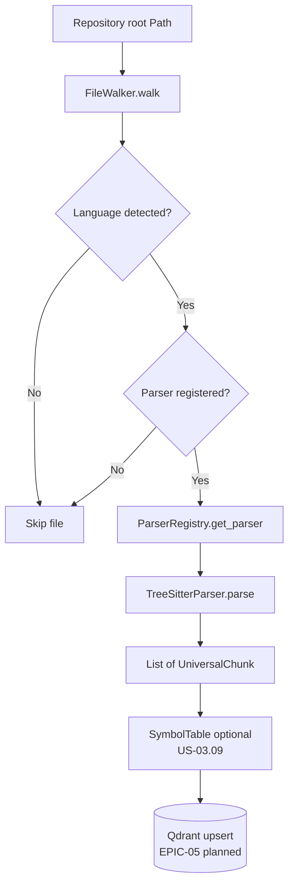
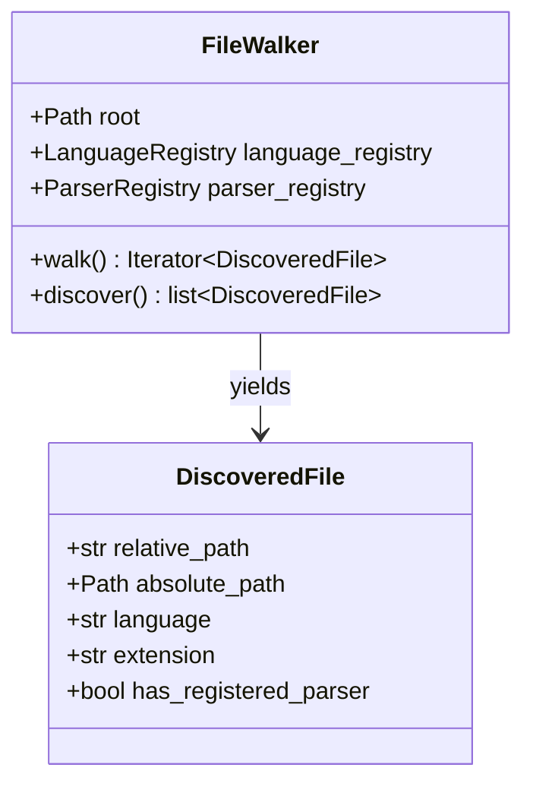
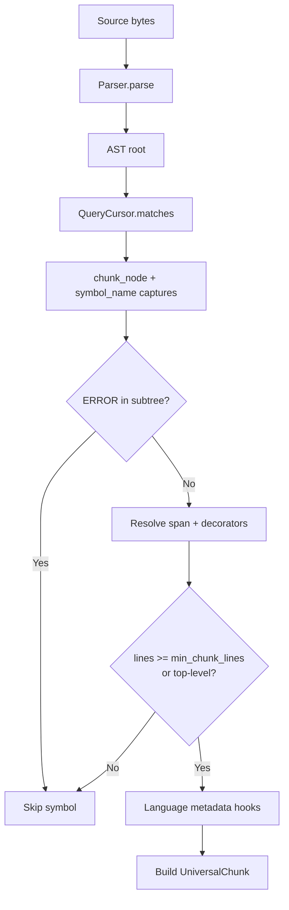
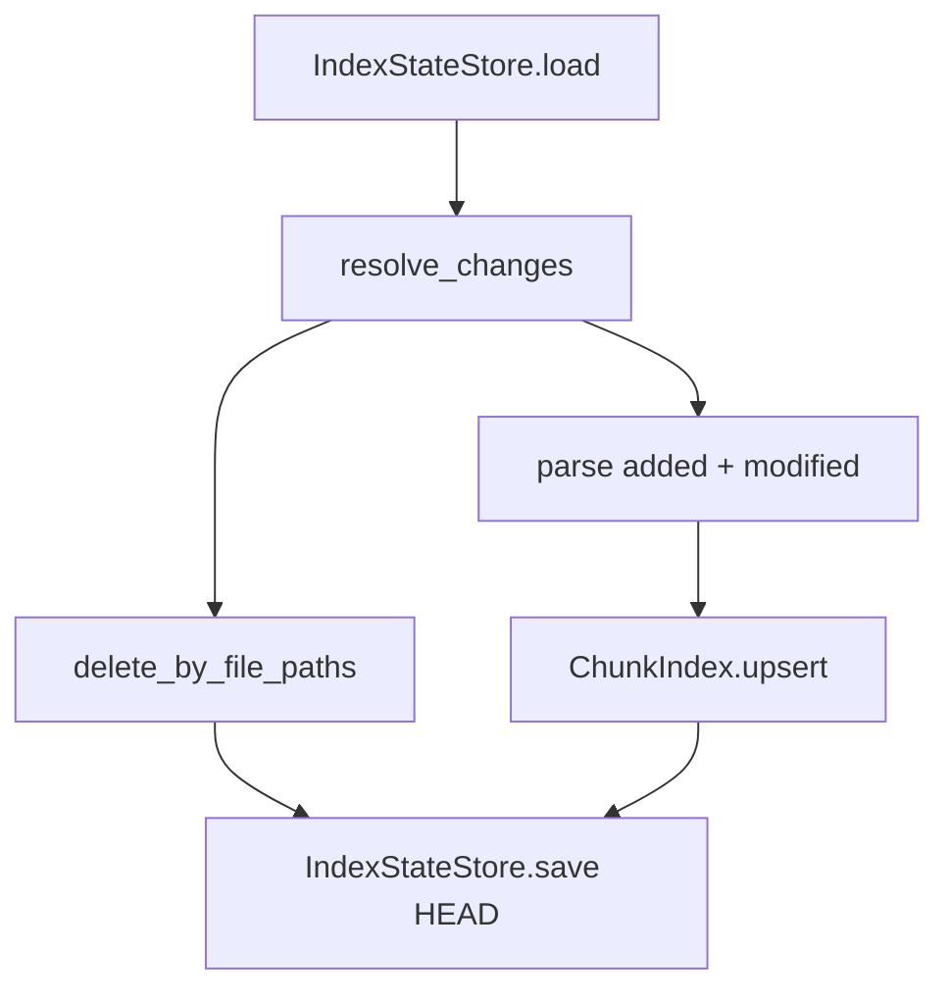

# As-Built: Code Ingestion Pipeline (EPIC-03)

This document describes the **implemented** code ingestion stack as of EPIC-03 (Tree-sitter parsers, registry, rules). It complements the target narrative in [high-level-architecture.md](high-level-architecture.md).

*Implementation tracker: [IMPLEMENTATION_STATUS.md](../IMPLEMENTATION_STATUS.md)*

---

## Pipeline Overview



---

## 1. File Discovery (US-03.01)

`FileWalker` (`src/drishti/ingestion/walker.py`) performs:

1. Sorted directory iteration (deterministic output).
2. `.gitignore` evaluation via `GitignoreMatcher`.
3. Path traversal guard (`is_path_within_root`).
4. Optional magic-byte read (512 B) for shebang detection.
5. Language assignment through `LanguageRegistry`.
6. Parser availability flag via `ParserRegistry.registered_extensions()`.



---

## 2. Parser Catalog (US-03.02–03.06)

All production parsers are registered through `PARSER_CATALOG` (`ingestion/ast/catalog.py`):

| Extensions | Parser class | Query file |
|------------|--------------|------------|
| `.py`, `.pyi`, `.pyw` | `PythonParser` | `python.scm` |
| `.java` | `JavaParser` | `java.scm` |
| `.js`, `.jsx`, `.mjs`, `.cjs` | `JavaScriptParser` | `javascript.scm` |
| `.ts` | `TypeScriptParser` | `typescript.scm` |
| `.tsx` | `TypeScriptParser` (TSX grammar) | `typescript.scm` |
| `.go` | `GoParser` | `go.scm` |

`create_default_parser_registry()` wires one parser instance per extension group. TypeScript and TSX use **separate** parser instances (different Tree-sitter grammars).

### Rule engine (`parser_rules.json`)

```json
{
  "defaults": { "min_chunk_lines": 3 },
  "languages": {
    "python": { "query": "python.scm", "min_chunk_lines": 3 },
    "java":   { "query": "java.scm",   "min_chunk_lines": 3 }
  }
}
```

`TreeSitterParser` skips **nested** symbols shorter than `min_chunk_lines` while keeping short **top-level** declarations (type aliases, package clauses).

---

## 3. Tree-sitter Parse Algorithm



### Language-specific metadata (implemented)

| Language | Package / module | Imports | Parent scope | Exports |
|----------|------------------|---------|--------------|---------|
| Python | — | — | `class_definition` | — |
| Java | `package_declaration` | — | class / interface | Annotations |
| JS / TS | — | module paths (regex + AST) | `class_declaration` | `export` / `default` |
| Go | `package_clause` | import paths | method receiver type | — |

---

## 4. Query Assets

Tree-sitter queries live in `src/drishti/ingestion/queries/*.scm` and load via `importlib.resources` (`TreeSitterParser.load_query`).

Example (Python):

```scheme
(class_definition
  name: (identifier) @symbol_name) @chunk_node

(function_definition
  name: (identifier) @symbol_name) @chunk_node
```

---

## 5. Output: UniversalChunk

Every parser emits Pydantic-validated [UniversalChunk](../design/universal-chunk-schema.md) objects. Core fields populated today:

- Structural: `content`, `start_line`, `end_line`, `node_type`, `name`
- Scope: `parent_class`, `package_name`
- Modifiers: `decorators`, `exports`
- References: `dependencies` (module-level imports on JS/TS/Go)
- Enrichment: `docstring`, `parameters`, `return_type`, `cyclomatic_complexity`, `context_path`, `imported_symbols` (US-03.07–09)

---

## 6. Testing & Quality Gates

| Layer | Tests |
|-------|-------|
| Per-language parsers | `tests/unit/test_*_parser.py` |
| Rules / catalog | `tests/unit/test_parser_rules.py` |
| Walker + registry | `tests/unit/test_walker.py` |
| Metadata enrichment | `tests/unit/test_metadata_enrichment.py` |
| Git incremental index | `tests/unit/test_git_incremental.py` |
| Full CI parity | `make ci-precheck` |

---

## 7. Git Incremental Indexing (US-03.10)



| Module | Responsibility |
|--------|----------------|
| `git_changes.py` | `GitChangeSet`, diff vs indexed commit |
| `index_state.py` | `.drishti/index-state.json` persistence |
| `incremental.py` | `IncrementalIndexer.run()` orchestration |
| `chunk_index.py` | `ChunkIndex` / `InMemoryChunkIndex` (Qdrant in EPIC-05) |

See [sequence-diagrams.md § Incremental indexing](sequence-diagrams.md#incremental-indexing-planned-us-0310).
