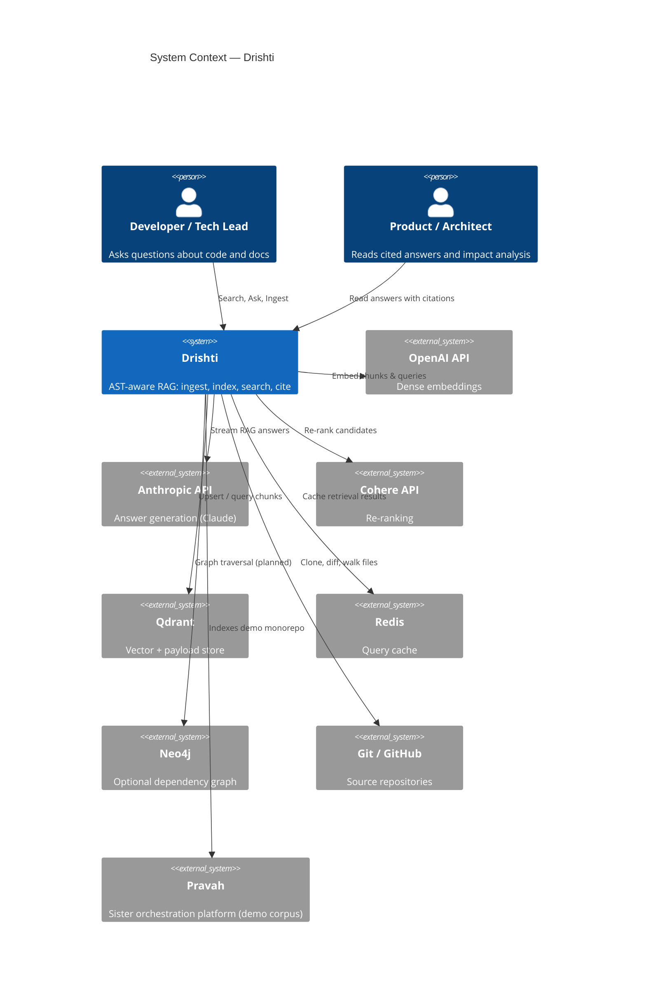
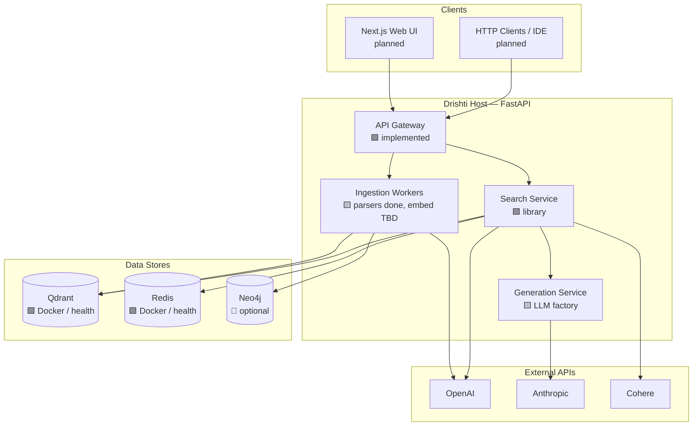
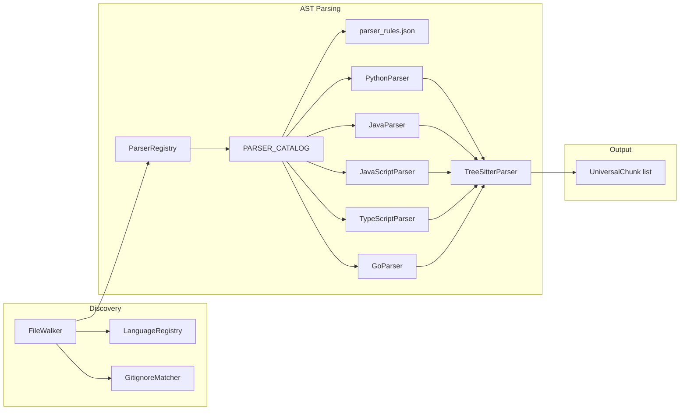
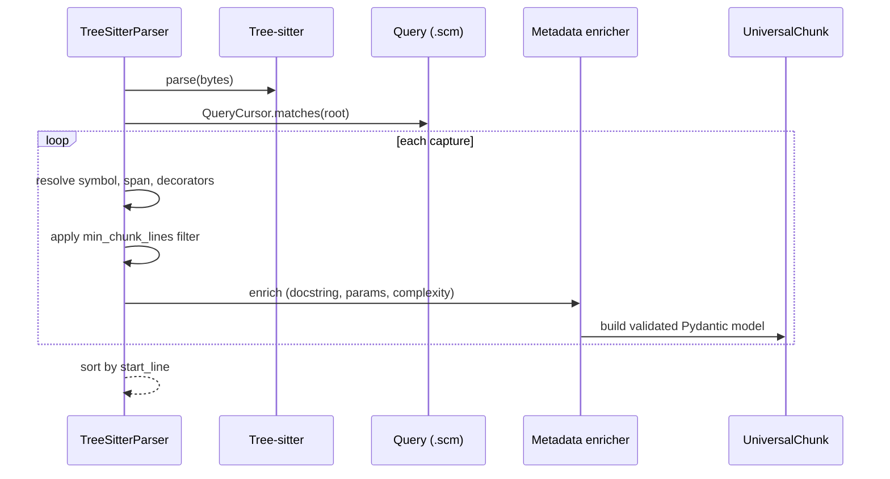

# C4 Model: Drishti

The [C4 model](https://c4model.com/) structures architecture documentation into four zoom levels. This document uses **Mermaid** diagrams so they render in GitHub, IDEs, and documentation portals without external tools.

---

## Level 1: System Context

Drishti sits between developers and organizational knowledge (codebases, specs, diagrams). External systems supply models, storage, and optional orchestration.

---

## Level 2: Container Diagram

Runtime containers in the **target** production layout. Shaded components are implemented today; dashed are planned.

| Container | Technology | Status |
|-----------|------------|--------|
| API Gateway | FastAPI + Uvicorn | Health, config, middleware, OpenAPI |
| Ingestion | Python package `drishti.ingestion` | Walker, parsers, chunk schema |
| Search / Generation | `drishti.search`, `drishti.generation` | Scaffolding only |
| Qdrant | Docker Compose | Integration-tested |
| Redis | Docker Compose | Integration-tested |

---

## Level 3: Component — Ingestion

Components inside the ingestion path that are **implemented** on `develop` (EPIC-03).

### Responsibilities

| Component | Module | Responsibility |
|-----------|--------|----------------|
| `FileWalker` | `ingestion/walker.py` | Recursive repo scan, ignore rules, magic-byte detection |
| `LanguageRegistry` | `utils/language.py` | Extension + shebang → language id |
| `ParserRegistry` | `ingestion/base.py` | Extension → parser instance |
| `PARSER_CATALOG` | `ingestion/ast/catalog.py` | Production parser factories |
| `ParserRules` | `ingestion/ast/rules.py` | Query file + `min_chunk_lines` per language |
| `TreeSitterParser` | `ingestion/ast/base.py` | Query captures → `UniversalChunk` |

---

## Level 4: Code — Parser Parse Flow

> **Note:** The metadata enricher step corresponds to US-03.07 (see [Universal Chunk Schema](../design/universal-chunk-schema.md) for field rollout).

---

## View Mapping

| Stakeholder question | Start here |
|---------------------|------------|
| What does Drishti connect to externally? | Level 1 |
| What do we deploy? | Level 2 + [deployment-topology.md](deployment-topology.md) |
| How does code become chunks? | Level 3 + [as-built-code-ingestion.md](as-built-code-ingestion.md) |
| What classes implement parsing? | Level 4 + [LLD Chapter 01](../lld/01-design-patterns.md) |
