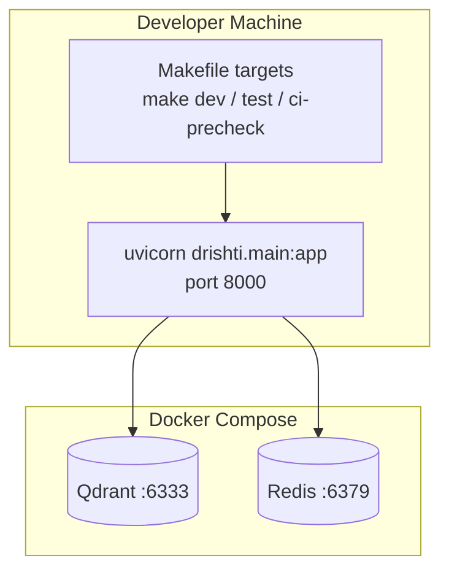
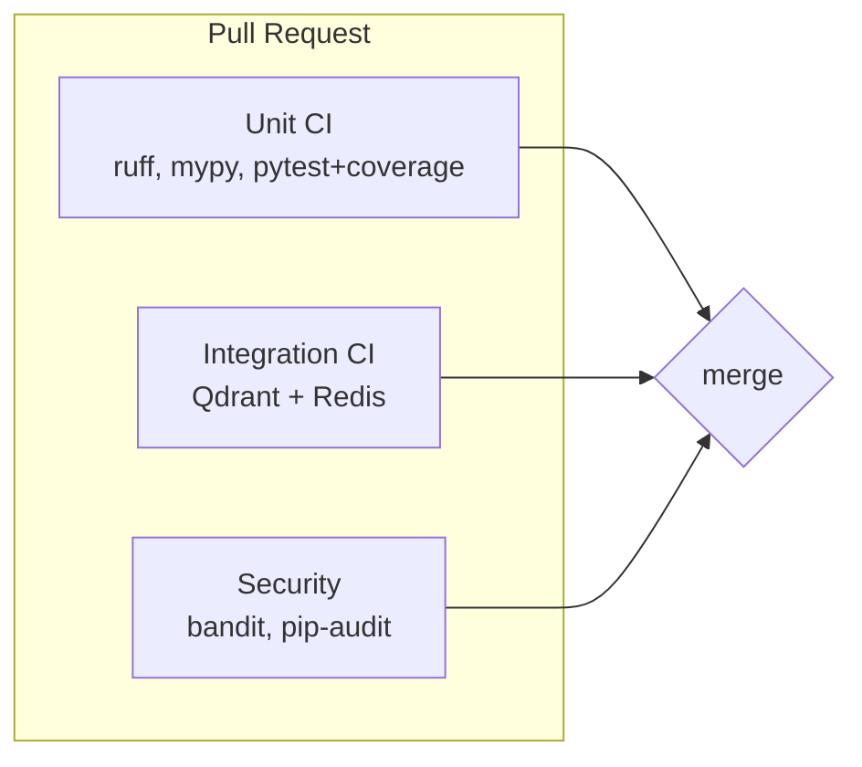
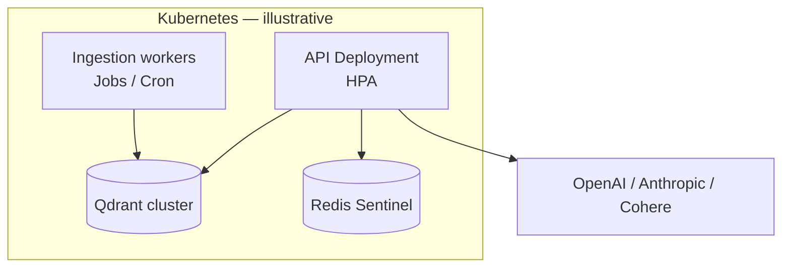

# Deployment Topology

How Drishti runs locally, in CI, and in the target production layout.

---

## Local Development



| Service | Image / command | Port | Purpose |
|---------|-----------------|------|---------|
| API | `make dev` → Uvicorn | 8000 | REST + OpenAPI (`/docs`) |
| Qdrant | `docker-compose.yml` | 6333 | Vector DB (integration tests) |
| Redis | `docker-compose.yml` | 6379 | Cache (integration tests) |

Environment variables: copy `.env.example` → `.env` (API keys for future embed/generate paths).

---

## CI Pipeline (GitHub Actions)



| Workflow | Trigger | Validates |
|----------|---------|-----------|
| `ci.yml` | PR / push `develop` | Lint, types, unit tests (≥70% cov), Docker build |
| `integration-ci.yml` | PR / push | Health probes, Qdrant scroll, Redis |
| `security.yml` | Schedule + PR | Bandit, dependency audit |

Local parity: **`make ci-precheck`** (see [operations/README.md](../operations/README.md)).

---

## Application Container (Dockerfile)

```mermaid
flowchart TB
    subgraph build [Multi-stage build]
        UV[uv sync --frozen --no-dev]
        SRC[Copy src/ + pyproject]
    end

    subgraph runtime [python:3.12-slim]
        VENV[/app/.venv]
        USER[non-root drishti user]
        CURL[healthcheck curl]
    end

    build --> runtime
```

- **Builder**: installs locked dependencies with `uv`.
- **Runtime**: non-root user, includes `git` and `curl` for health checks and future git walker.
- Tree-sitter grammars ship as Python wheels (`tree-sitter-*` packages).

---

## Target Production (Phase 3+)



Secrets: API keys via sealed secrets or cloud secret manager. Repository clones via mounted volumes or ephemeral CI runners.

---

## Network & Ports

| Endpoint | Protocol | Notes |
|----------|----------|-------|
| `/health/live` | HTTP | Liveness — no dependency checks |
| `/health/ready` | HTTP | Readiness — Qdrant + Redis |
| `/docs` | HTTP | OpenAPI UI (disable in prod or protect) |

---

## Related

- [Dockerfile](../../Dockerfile), [docker-compose.yml](../../docker-compose.yml)
- [CONTRIBUTING.md](../../CONTRIBUTING.md) — branch & PR workflow
- [C4 Container diagram](c4-model.md#level-2-container-diagram)
