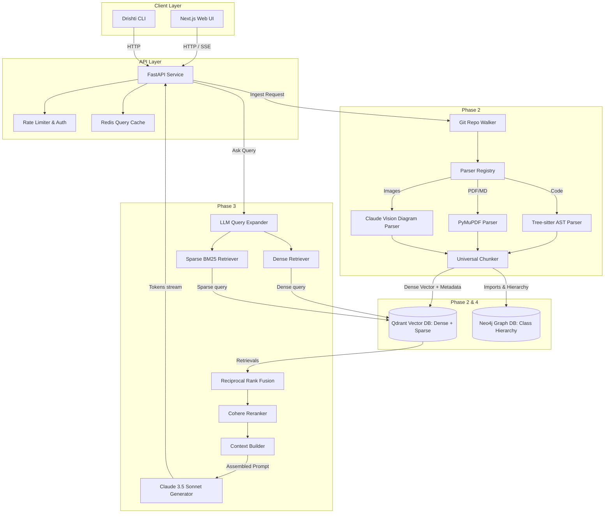

# High-Level Architecture: Drishti (दृष्टि)

---

## Table of Contents

1. [Architectural Goals & Principles](#1-architectural-goals--principles)
2. [System Architecture Overview](#2-system-architecture-overview)
3. [Ingestion Pipeline (Data Inflow)](#3-ingestion-pipeline-data-inflow)
4. [Storage Subsystems](#4-storage-subsystems)
5. [Search & Retrieval Pipeline](#5-search--retrieval-pipeline)
6. [Response Generation & Citation Lifecycle](#6-response-generation--citation-lifecycle)
7. [API Gateway & Communication Contracts](#7-api-gateway--communication-contracts)
8. [Data Consistency & Incremental Indexing](#8-data-consistency--incremental-indexing)
9. [Non-Functional Requirements (NFRs)](#9-non-functional-requirements-nfrs)

---

## 1. Architectural Goals & Principles

Drishti is designed as an enterprise-grade, high-performance RAG platform built on five foundational engineering principles:

* **Syntax-Aware Semantic Partitioning**: Traditional RAG partitions code arbitrarily, destroying context. Drishti uses syntax trees to partition code according to language boundaries (classes, interfaces, methods, functions).
* **Multi-Modal Synchronization**: Links visual assets (architecture diagrams, flowcharts) and unstructured prose (PDF specs, markdown docs) to their corresponding codebases under a single, unified semantic namespace.
* **Hybrid Retrieval Fusion**: Leverages dense vector searches (for semantic intent) alongside sparse token searches (for exact keyword/class name matching), resolved via Reciprocal Rank Fusion (RRF).
* **Source Attribution (Citation Auditability)**: Answers generated by the LLM must contain verifiable citations pointing to exact file paths and line ranges. Hallucinated or non-existent file references are filtered out.
* **Incremental Synchronization**: Operates on git differences, calculating modification sets so that large codebases are re-indexed dynamically in seconds rather than hours.

---

## 2. System Architecture Overview

The system is decoupled into three primary execution pipelines: **Ingestion**, **Search**, and **Generation**. The communication is brokered by a FastAPI REST gateway.



---

## 3. Ingestion Pipeline (Data Inflow)

The ingestion pipeline converts diverse input formats (code repositories, technical specifications, database schemas, and diagrams) into a normalized stream of structured chunks.

### A. Language-Aware Routing
Incoming documents pass through a file detector. The detector uses extension mappings and magic headers to determine the file type and routes it to the corresponding parser class:

* **`TreeSitterParser`**: Registered for `.py`, `.java`, `.js`, `.ts`, `.go`, `.rs`, `.cpp`. It uses Tree-sitter libraries to generate a Concrete Syntax Tree (CST) and traverses it.
* **`PyMuPDFParser`**: Registered for `.pdf`. Extracted text is grouped using font-size and paragraph bounding boxes to ensure lists, headers, and body blocks remain cohesive.
* **`MarkdownParser`**: Registered for `.md` and `.txt`. Partitions files based on heading hierarchies.
* **`ClaudeVisionParser`**: Registered for `.png`, `.jpg`, `.svg`. Submits diagrams to Claude with a system prompt optimized for transcribing block diagrams into markdown representations.

### B. AST Chunking Mechanics
The `TreeSitterParser` uses tree queries (S-expressions) to isolate specific syntax nodes:
```scheme
;; Example query to extract method declarations in Java
(method_declaration
  type: (type_identifier) @return_type
  name: (identifier) @method_name
  parameters: (formal_parameters) @params
  body: (block) @body)
```
When a query matches, the start/end lines are captured. The raw code content within those coordinates is extracted, and metadata annotations are generated (cyclomatic complexity, parameter names, imports).

### C. Universal Chunk Schema
Every parser converts its output into the **Universal Chunk Schema** (modeled in Pydantic):

```python
class UniversalChunk(BaseModel):
    id: str                          # UUIDv4
    source_id: str                   # Git Commit Hash / PDF File Hash
    content: str                     # Text content or code block
    content_type: str                # "code", "text", "table", "api_endpoint"
    file_path: str                   # File location path
    source_type: str                 # "git_repo", "pdf", "markdown", "image"
    language: str | None             # "python", "java", "typescript", etc.
    start_line: int | None           # Starting line number (1-indexed)
    end_line: int | None             # Ending line number (inclusive)
    page_number: int | None          # For PDF pages
    node_type: str | None            # "method_declaration", "class_declaration"
    name: str | None                 # Name of the symbol (e.g. "AuthService")
    parent_class: str | None         # Enclosing class context
    decorators: list[str] = []       # Decorator names (e.g. dataclass, property)
    dependencies: list[str] = []     # External symbol imports
    last_modified: datetime          # Git commit datetime or file datetime
```

---

## 4. Storage Subsystems

Drishti uses two databases, optimizing for vector search and structured graph queries.

### 4.1 Qdrant Vector Store
All chunks are written to Qdrant. The collection is configured to hold two vectors per point:

1. **Dense Vector Field**: 1536 dimensions, using Cosine similarity. Filled by OpenAI `text-embedding-3-small`. Optimized for high-level semantic questions ("How are errors handled in authentication?").
2. **Sparse Vector Field**: Custom vocabulary tokenizer. Filled using term weights (BM25). Optimized for keyword matching ("jwt_secret", "OAuthException", "v1/users").

#### Payload Indexing & Filters
To support fast retrieval scoping, payload indexes are compiled on:
* `file_path` (keyword index)
* `language` (keyword index)
* `content_type` (keyword index)
* `source_id` (keyword index)

### 4.2 Neo4j Graph Database (Optional Extension)
Neo4j maps structural dependencies. When code is parsed, the package structures, class definitions, and function invocations are extracted.
* **Nodes**: Package, File, Class, Method, Field.
* **Relationships**:
  * `(Class)-[:CONTAINS]->(Method)`
  * `(Class)-[:EXTENDS]->(Class)`
  * `(Method)-[:CALLS]->(Method)`
  * `(File)-[:IMPORTS]->(File)`

This graph enables impact analysis: querying Neo4j for all nodes that have a path terminating at a modified method.

---

## 5. Search & Retrieval Pipeline

Retrieval combines keyword accuracy with semantic meaning, structured as a multi-stage process.

```
Incoming User Query
       │
       ▼
┌───────────────────────────────┐
│ LLM Query Expansion           │  Generate technical synonyms
└──────┬─────────────────┬──────┘
       │                 │
       ▼                 ▼
┌──────────────┐  ┌──────────────┐
│ Dense Search │  │ Sparse Search│  Parallel retrievals via Qdrant
│ (1536 Cosine)│  │ (BM25 Sparse)│
└──────┬───────┘  └──────┬───────┘
       │                 │
       ▼                 ▼
┌───────────────────────────────┐
│ Reciprocal Rank Fusion (RRF)  │  Score-agnostic ranking fusion
└──────────────┬────────────────┘
               │
               ▼
┌───────────────────────────────┐
│ Cohere Cross-Encoder Reranker │  Context relevance scoring (Top K)
└──────────────┬────────────────┘
               │
               ▼
┌───────────────────────────────┐
│ Context Compiler              │  Assemble LLM prompt
└───────────────────────────────┘
```

### A. Query Expansion
Queries like "db check" are expanded via a fast LLM utility to `["database_connection", "DbConnection", "initialize_db", "pool", "health_check"]` to account for variable nomenclature in codebases.

### B. Reciprocal Rank Fusion (RRF)
RRF merges ranking sheets from Dense and Sparse searches. It assigns a unified score to each document based on its ranks rather than raw similarity scores:

$$RRF\_Score(d) = \sum_{m \in M} \frac{1}{k + r_m(d)}$$

Where $M$ is the set of retrievers (Dense and Sparse), $r_m(d)$ is the rank of document $d$ in retriever $m$, and $k$ is a constant (default: 60).

### C. Cohere Cross-Encoder Reranker
The merged top-50 candidates are re-ordered by passing the query and the text of each chunk as a pair to the Cohere Cross-Encoder API. This evaluates deep sentence-to-sentence interactions and outputs a semantic score, reducing context noise and keeping only the top 10 most relevant chunks.

---

## 6. Response Generation & Citation Lifecycle

The context compiled is passed to Claude 3.5 Sonnet to stream the final answer.

### A. Context Packaging
Context is structured to preserve source locations:
```xml
<context_file path="src/auth.py" language="python">
[L10-18]
def verify_token(token: str):
    try:
        return jwt.decode(token, SECRET_KEY, algorithms=["HS256"])
    except jwt.PyJWTError:
        return None
</context_file>
```

### B. Citation Constraints
The LLM is governed by system instructions that mandate inline citations in the format `[filename:Lstart-lend]`. Example output:
> "Authentication tokens are verified using the PyJWT library in the function `verify_token` [src/auth.py:L10-18]. This checks the secret key signature."

### C. Backend Citation Validation
As tokens stream through the API, the backend intercepts citation strings, checking that:
1. The file path exists in the retrieved context pool.
2. The cited line range falls within the retrieved boundaries.

If the LLM outputs a hallucinated citation (referencing files not in context), the citation is removed or flagged in the stream.

---

## 7. API Gateway & Communication Contracts

FastAPI serves as the core broker, mapping asynchronous endpoints.
* **REST Endpoints**:
  * `POST /api/v1/ingest`: Starts repository indexing. Returns a job ID to track indexing status asynchronously.
  * `POST /api/v1/search`: Returns JSON list of raw hybrid-search results.
  * `POST /api/v1/ask`: Accepts question payloads and returns a chunked `Server-Sent Events (SSE)` stream containing text tokens, citations, and metadata.

* **Caching (Redis)**:
  Queries are hashed along with active commit hashes. If a match exists in Redis, the cached answer is streamed directly, bypassing vector searches and LLM invocations.

---

## 8. Data Consistency & Incremental Indexing

To prevent re-indexing the entire repository when small commits are pushed, Drishti utilizes a state tracking system:

1. **State Store**: Maintains a registry mapping each file path to its file hash and the git commit hash at the time of indexing.
2. **Git Diff Hook**: When a repository indexes, Drishti runs:
   ```bash
   git diff --name-status <last_indexed_commit> HEAD
   ```
3. **Execution Routing**:
   * **`A` (Added)**: Routed to ingestion pipelines to parse and index.
   * **`M` (Modified)**: Existing chunks matching the file path are purged from Qdrant/Neo4j, and the new file version is parsed and written.
   * **`D` (Deleted)**: Existing chunks matching the file path are deleted from all stores.

---

## 9. Non-Functional Requirements (NFRs)

* **Performance**:
  * Search retrieval execution time under 150ms.
  * Time-to-first-token (TTFT) for Q&A under 1.2 seconds.
* **Scalability**:
  * Supports ingestion of repositories containing up to 10,000 files without exceeding 2GB memory footprint on the ingestion service.
* **Reliability & Persistence**:
  * Qdrant and Redis data mapping persists using Docker volumes. Abrupt service termination must not corrupt vector collections.
* **Security**:
  * API endpoints must parse and validate payloads via Pydantic to prevent command injection through Git directory path arguments.
  * Secret credentials (OpenAI key, Anthropic key, DB credentials) must be loaded from secure environment variables, never hardcoded.
