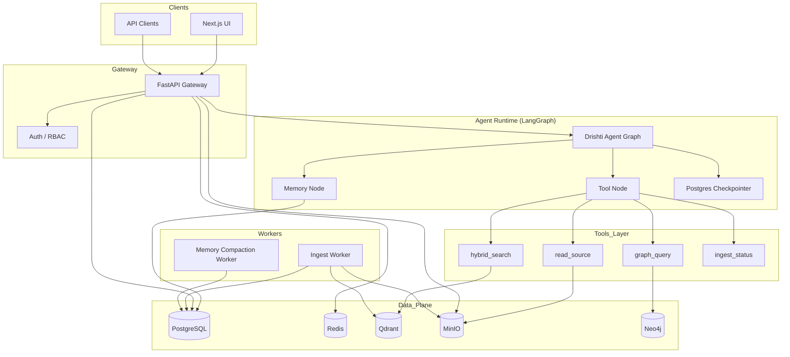

# Platform V2 — Agentic architecture & production data plane

**Status:** Approved direction (planning) · **Target:** Drishti as a **code-and-docs intelligence platform** competitive with general assistants *on repository Q&A*, not as a replacement for ChatGPT’s open-world knowledge.

Related: [High-Level Architecture](high-level-architecture.md) · [Production Roadmap (V1)](production-roadmap.md) · [Product Vision](../product/PRODUCT-VISION.md)

---

## 1. Honest positioning vs ChatGPT / Claude / Gemini

| Dimension | General assistants (ChatGPT, Claude, Gemini) | Drishti V2 |
|-----------|-----------------------------------------------|------------|
| **Knowledge** | Broad pretraining + optional web | **Only what you indexed** (repos, uploads, specs) |
| **Grounding** | Often weak; citations optional | **Mandatory citations** to file:line / page |
| **Code structure** | Text chunks | **AST-aware** (Tree-sitter) + layout-aware PDF |
| **Private / air-gapped** | Cloud-only or enterprise contract | **Self-hosted** (Ollama, local Qdrant, MinIO) |
| **Impact analysis** | Limited | **Neo4j graph** (EPIC-09) + agent tools |
| **Agent loops** | Opaque product feature | **Explicit LangGraph** (inspectable, testable) |

**Drishti wins** when the user’s question is: *“What does **our** codebase and **our** docs say?”*  
**Drishti does not win** on: recipes, news, creative writing without sources.

Product tagline for V2: **“The AI that only answers from your engineering truth — with proof.”**

---

## 2. What we keep vs what we replace

### Keep (differentiators — do not LangChain-ify away)

| Component | Why |
|-----------|-----|
| Tree-sitter ingestion | Core IP; LangChain `TextLoader` is not equivalent |
| `ContentRouter` | Intelligent MIME/sniff routing |
| `HybridSearchPipeline` + RRF + rerank | Battle-tested; wrap as LangChain retriever |
| Qdrant hybrid collections | Best fit for dense+sparse |
| Citation validation | Trust layer for engineers |
| Universal Chunk schema | Cross-modal contract |

### Evolve (agentic layer)

| Today | V2 |
|-------|-----|
| ~~Linear `RAGPipeline.ask()`~~ (removed) | **LangGraph** state machine: retrieve → grade → generate → verify citations |
| Hand-rolled Redis message list | **Postgres + LangGraph checkpointer** for threads |
| Manual `PUT /memory` | **Memory subgraph**: summarize → extract entities → store in PG + optional vector memory |
| Sync ingest API | **Celery/Arq workers** + job status in Postgres |
| Local filesystem artifacts | **MinIO** (S3 API) + metadata in Postgres |

### Add (table stakes for “real product”)

- **PostgreSQL** — system of record (users, workspaces, conversations, jobs, audit)
- **MinIO** — object store for uploads, exports, large PDFs
- **LangChain** — tool adapters, retriever interface, tracing (LangSmith optional)
- **LangGraph** — agent orchestration, branching, human-in-the-loop, retries
- **Auth** — OIDC (Google/GitHub/enterprise) + API keys per workspace
- **Eval CI** — EPIC-11 RAGAS gates on every PR

---

## 3. Target architecture (V2)



---

## 4. Data store responsibilities (“best DB for each job”)

| Store | Role | Why this choice |
|-------|------|-----------------|
| **PostgreSQL 16+** | Users, orgs, workspaces, conversations, messages, ingest jobs, artifact metadata, API keys, audit logs, LangGraph checkpoints (`langgraph-checkpoint-postgres`) | ACID, joins, RLS for multi-tenant, mature ops |
| **Qdrant** | Chunk embeddings (dense + sparse), hybrid search, payload filters (`workspace_id`, `file_path`, `language`) | Already integrated; leader for filtered vector + BM25 fusion |
| **MinIO** | Raw uploads (PDF, zip of repo export), parsed intermediates, conversation exports | S3-compatible, self-hosted, cheap at scale |
| **Redis** | Rate limits, hot query cache, pub/sub for job progress SSE, optional secondary checkpoint cache | Low-latency; already in stack |
| **Neo4j** | Code dependency graph, impact analysis (EPIC-09) | Graph traversals unsuitable for PG/Qdrant |
| **Optional: pgvector extension** | Small-set semantic memory (glossary, decisions) per workspace | Keeps “memories” queryable without overloading Qdrant |

**Not recommended:** Using only Qdrant or only Postgres for everything. Vector DBs are poor system-of-record; RDBMS is poor hybrid sparse retrieval.

---

## 5. LangGraph agent design

### 5.1 Graph nodes (default “ask” flow)

```
START → understand_query → retrieve_hybrid → grade_documents → [insufficient?] → expand_query ↺
                                                      ↓ sufficient
                                            optional_graph_expand → build_context → generate → validate_citations → persist_turn → END
```

| Node | Responsibility |
|------|----------------|
| `understand_query` | Classify intent: code lookup / architecture / API / impact / doc compliance |
| `retrieve_hybrid` | Call existing `HybridSearchPipeline` (wrapped as LC tool) |
| `grade_documents` | LLM grader: are chunks relevant? (LangGraph pattern from RAG tutorials) |
| `expand_query` | Optional query expansion (existing `LLMQueryExpander`) |
| `optional_graph_expand` | If impact/dependency intent → Neo4j tool |
| `build_context` | Existing `ContextBuilder` XML |
| `generate` | Provider-agnostic LLM (keep `create_chat_llm`) |
| `validate_citations` | Existing citation pipeline |
| `persist_turn` | Write messages + trigger async memory compaction job |

### 5.2 LangChain tools (wrap existing code)

```python
# Conceptual — implement in src/drishti/agent/tools/
@tool
def hybrid_search(query: str, workspace_id: str, filters: dict) -> list[Chunk]: ...

@tool
def read_source_file(path: str, start_line: int, end_line: int) -> str: ...

@tool
def graph_impact(symbol: str, workspace_id: str) -> list[str]: ...  # EPIC-09

@tool
def list_ingest_status(workspace_id: str) -> dict: ...
```

**Rule:** Tools call **Drishti services**, not external APIs directly — preserves testability and provider abstraction.

### 5.3 Memory model (three layers)

| Layer | Storage | TTL | Content |
|-------|---------|-----|---------|
| **Thread** | Postgres (checkpointer + `messages` table) | User-defined / 90d | Full chat turns |
| **Workspace semantic** | Postgres `workspace_facts` + optional pgvector | Long | Summarized glossary, decisions, recurring entities |
| **Episodic** | Postgres `memory_events` | Long | “User asked about auth 5 times” → boost retrieval bias |

Compaction job (worker): after each session, LangGraph **memory subgraph** runs summarization → structured JSON facts → UPSERT — not raw chat stored forever in prompt.

---

## 6. Ingestion & artifacts (MinIO-centric)

### Upload flow

1. Client `POST /workspaces/{id}/artifacts` → stream to **MinIO** `s3://drishti/{workspace_id}/raw/{uuid}/{filename}`
2. Postgres `artifacts` row: id, workspace_id, minio_key, mime, size, status=`pending`
3. Worker picks job → `ContentRouter` → parsers → Qdrant upsert → `status=indexed`
4. WebSocket/SSE: `ingest.progress` events via Redis pub/sub

### Repo flow

- GitHub clone metadata in Postgres; bare repo mirror in MinIO or local volume
- Incremental indexer unchanged in spirit; job tracked in `ingest_jobs` table

---

## 7. New epics (V2 program)

| Epic | Title | Points (est.) | Outcome |
|------|-------|---------------|---------|
| **EPIC-14** | LangGraph agent runtime | 55 | Replace linear RAG with graph; tools; streaming |
| **EPIC-15** | Data platform (Postgres + MinIO) | 42 | SoR, uploads, jobs, migrations |
| **EPIC-16** | Auth, RBAC, observability | 34 | OIDC, tenancy, LangSmith/OpenTelemetry |
| **EPIC-17** | Product UX parity | 55 | Threads UI, uploads, jobs, settings |
| **EPIC-11** | Eval CI (existing) | 34 | RAGAS golden set gates merge |
| **EPIC-09** | Graph (existing) | 34 | Neo4j + `graph_impact` tool |

**Total V2 extension:** ~254 SP (~5–7 months with 1–2 engineers), after current EPIC-04/13 land.

---

## 8. Phased delivery plan

### Phase V2.0 — Data foundation (weeks 1–4)

- [ ] ADR-012 Postgres, ADR-013 MinIO, docker-compose services
- [ ] SQLAlchemy 2 + Alembic migrations
- [ ] Tables: `organizations`, `users`, `workspaces`, `artifacts`, `ingest_jobs`, `conversations`, `messages`
- [ ] MinIO client; migrate artifact upload off local disk
- [ ] Dual-write: Redis conversations → Postgres (migration path)

**Exit:** Upload PDF → MinIO → job row → worker indexes → searchable.

### Phase V2.1 — Agent runtime (weeks 5–10)

- [ ] `langgraph`, `langchain-core`, `langchain-community` dependencies (pinned)
- [ ] `src/drishti/agent/graph.py` — compile graph
- [ ] `src/drishti/agent/checkpointer.py` — Postgres
- [ ] Wrap `HybridSearchPipeline` as retriever tool
- [x] `/ask` and `/conversations/{id}/ask` invoke `AgentRunner` (LangGraph)
- [ ] Streaming via LangGraph `astream_events` → existing SSE format (UI unchanged)

**Exit:** Multi-step retrieval (grade + optional re-query) beats linear RAG on golden set.

### Phase V2.2 — Memory & jobs (weeks 11–14)

- [ ] Arq or Celery worker container
- [ ] Memory compaction subgraph + scheduler
- [ ] Async ingest with progress API
- [ ] EPIC-11 eval in CI (block merge if faithfulness &lt; threshold)

### Phase V2.3 — Enterprise & UX (weeks 15–20)

- [ ] OIDC login; workspace RBAC
- [ ] UI: thread list, upload manager, job progress, memory viewer
- [ ] Neo4j + impact tool in graph
- [ ] Production Helm chart (PG, Qdrant, Redis, MinIO, API, worker)

---

## 9. Dependency additions (planned)

```toml
# Agent
langgraph>=0.2.0
langchain-core>=0.3.0
langchain-community>=0.3.0
langgraph-checkpoint-postgres>=2.0.0

# Data
sqlalchemy[asyncio]>=2.0.0
alembic>=1.13.0
asyncpg>=0.29.0
minio>=7.2.0

# Workers
arq>=0.26.0  # or celery[redis]>=5.4.0
```

Keep **provider-agnostic LLM** (`create_chat_llm`) — LangChain `ChatModel` adapter optional bridge, not vendor lock-in.

---

## 10. API surface (V2 target)

| Area | Endpoints |
|------|-----------|
| Auth | `POST /auth/login`, `GET /auth/me` |
| Workspaces | CRUD + `POST /workspaces/{id}/artifacts` (MinIO) |
| Ingest | `POST /workspaces/{id}/ingest`, `GET /jobs/{id}` |
| Chat | `POST /conversations`, `POST /conversations/{id}/messages`, `POST /conversations/{id}/stream` (graph) |
| Memory | `GET/PUT /workspaces/{id}/memory`, `GET /workspaces/{id}/memory/facts` |
| Admin | `GET /health`, metrics, LangSmith trace IDs in response headers |

Deprecated path: client-supplied unbounded `conversation_history` on `/ask` (keep for SDK compat, prefer server threads).

---

## 11. Quality bar (“world tested”)

Aligned with [PRODUCT-VISION.md](../product/PRODUCT-VISION.md) metrics:

| Gate | Tool |
|------|------|
| Retrieval precision/recall | RAGAS on golden repo (EPIC-11) |
| Citation validity | 100% resolved paths exist in index |
| Agent regressions | LangGraph snapshot tests + fixture graphs |
| Load | k6: 50 concurrent streams, p95 first token &lt; 2s |
| Security | OWASP ZAP on API; MinIO presigned URLs time-limited |

---

## 12. Migration from current codebase

1. **Agent path** — LangGraph only; `RAGPipeline` is retrieval/context, not a separate ask API.
2. EPIC-13 Redis conversations → migrate to Postgres via script.
3. Local workspace cache → MinIO copy job.
4. Existing Qdrant collection compatible; add payload `workspace_id` if missing (reindex once).

---

## 13. Decision records

| ADR | Topic |
|-----|--------|
| [ADR-011](../adr/ADR-011-langgraph-agent-orchestration.md) | LangGraph for agent control flow |
| [ADR-012](../adr/ADR-012-postgresql-system-of-record.md) | PostgreSQL as SoR |
| [ADR-013](../adr/ADR-013-minio-object-storage.md) | MinIO for artifacts |

---

## 14. Immediate next steps (engineering)

1. Review and approve this doc + ADRs in PR.
2. Merge EPIC-04/13 (ingestion + platform base).
3. Open **`feature/EPIC-15-data-platform`** — Postgres + MinIO + Alembic + docker-compose.
4. Open **`feature/EPIC-14-langgraph-agent`** after V2.0 schema exists.

**Do not** add LangGraph before Postgres — checkpoints and messages need a real SoR first.
