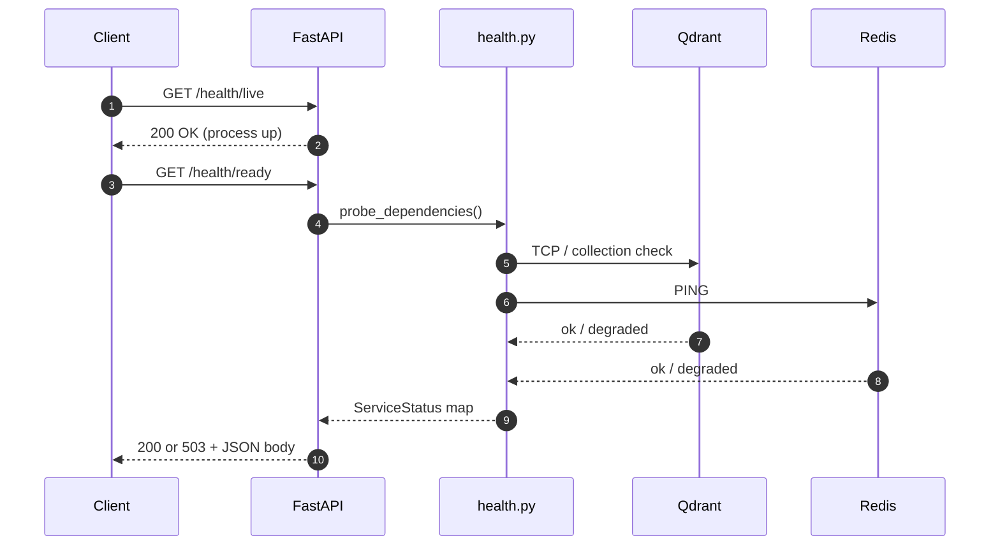
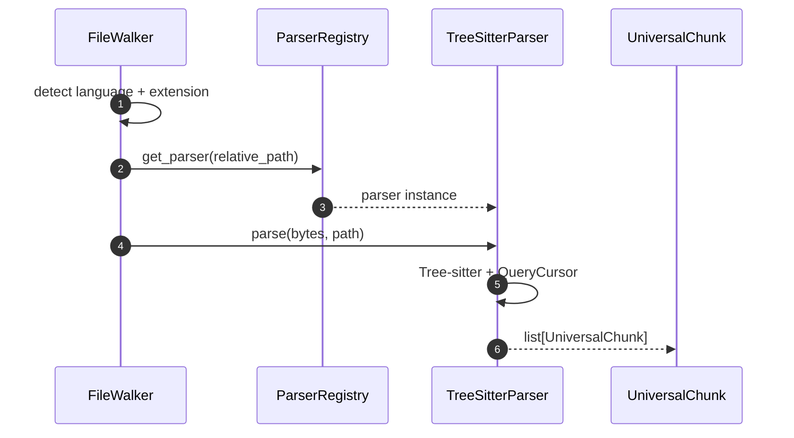
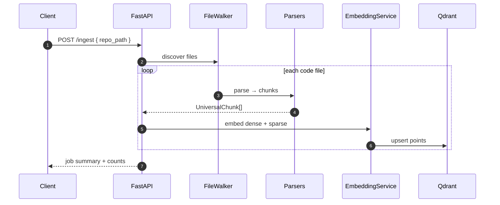
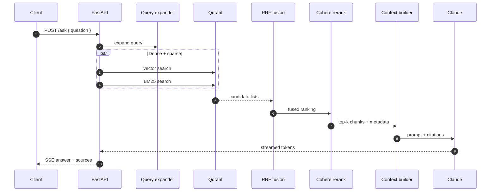
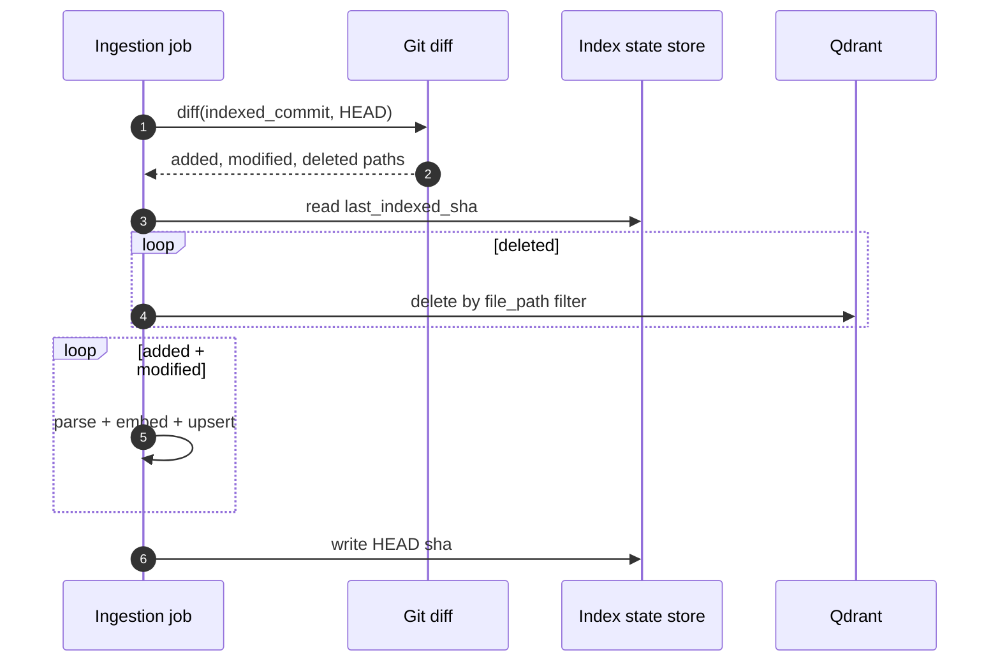

# Sequence Diagrams

End-to-end lifecycles for Drishti services. **Solid** flows are implemented; **dotted** flows are planned.

---

## Health & Readiness (Implemented)

---

## Code File Parse (Implemented)

---

## Full Repository Ingest (Target)

> Embedding and Qdrant upsert are implemented (`ChunkEmbeddingPipeline`, `QdrantChunkStore`) but **not yet wired to the HTTP API** (EPIC-08).

---

## Hybrid Search & Ask (Target)

---

## Incremental Indexing (Implemented — US-03.10)

---

## Cross-References

- [As-built ingestion](as-built-code-ingestion.md)
- [API contracts](../design/api-contracts.md)
- [Search pipeline LLD](../lld/04-search-pipeline.md)
