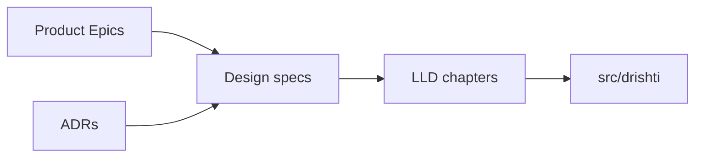

# Design Specifications

Design documents define **contracts** and **data structures** shared across ingestion, storage, search, and the API.

| Document | Description |
|----------|-------------|
| [API Contracts](api-contracts.md) | REST endpoints, WebSocket streaming, error envelopes |
| [Universal Chunk Schema](universal-chunk-schema.md) | Canonical chunk model — fields, types, examples |

---

## Relationship to Other Docs

- **Product** defines *what* users need ([epics](../product/epics/)).
- **Design** defines *interfaces* (this folder).
- **LLD** defines *algorithms and class collaborations* ([lld/](../lld/)).
- **ADRs** record *technology choices* ([adr/](../adr/)).
