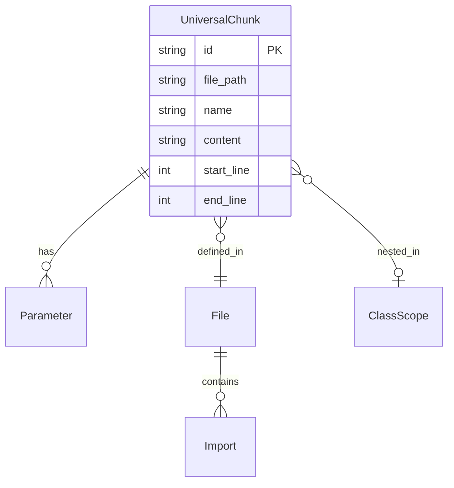

# Universal Chunk Schema

The **Universal Chunk** is Drishti's normalized unit of knowledge. All parsers (code, PDF, Markdown, OpenAPI) emit the same Pydantic model so embedding, Qdrant payloads, and citations stay consistent.

**Source of truth (code):** `src/drishti/api/schemas.py` — class `UniversalChunk`.

---

## Design Goals

1. **Citation-ready** — `file_path`, `start_line`, `end_line` for IDE navigation.
2. **Filter-ready** — `language`, `content_type`, `node_type` map to Qdrant payload indexes.
3. **Structure-aware** — `parent_class`, `context_path`, `package_name` preserve scope.
4. **Search-enriched** — parameters, docstrings, complexity support advanced filters (US-03.07).

---

## Entity Relationship (Conceptual)



---

## Field Reference

| Field | Type | Required | Status | Description |
|-------|------|----------|--------|-------------|
| `id` | `str` | yes | 🟩 | UUIDv4 chunk identifier |
| `source_id` | `str` | yes | 🟩 | Content hash (git SHA planned for commits) |
| `content` | `str` | yes | 🟩 | Raw text / source snippet |
| `content_type` | enum | yes | 🟩 | `code`, `text`, `table`, `image_description`, `api_endpoint` |
| `file_path` | `str` | yes | 🟩 | Repo-relative path |
| `source_type` | enum | yes | 🟩 | `git_repo`, `pdf`, `markdown`, `image`, `openapi` |
| `language` | `str?` | no | 🟩 | e.g. `python`, `java`, `typescript`, `go` |
| `start_line` | `int?` | no | 🟩 | 1-indexed start (inclusive) |
| `end_line` | `int?` | no | 🟩 | 1-indexed end (inclusive) |
| `page_number` | `int?` | no | 🔮 | PDF page index |
| `node_type` | `str?` | no | 🟩 | Tree-sitter node type |
| `name` | `str?` | no | 🟩 | Symbol name |
| `parent_class` | `str?` | no | 🟩 | Enclosing class / receiver scope |
| `package_name` | `str?` | no | 🟩 | Java package or Go package clause |
| `decorators` | `list[str]` | no | 🟩 | Normalized decorator / annotation names |
| `exports` | `list[str]` | no | 🟩 | e.g. `export`, `default` |
| `dependencies` | `list[str]` | no | 🟩 | Module import paths |
| `docstring` | `str?` | no | 🟩 | Leading doc / comment block (US-03.07) |
| `parameters` | `list[str]` | no | 🟩 | Formal parameter descriptors (US-03.07) |
| `return_type` | `str?` | no | 🟩 | Declared return type (US-03.07) |
| `cyclomatic_complexity` | `int?` | no | 🟩 | McCabe score ≥1 (US-03.07) |
| `parent_module` | `str?` | no | 🟩 | Module / package id (US-03.08) |
| `context_path` | `str?` | no | 🟩 | `file::Scope::symbol` (US-03.08) |
| `imported_symbols` | `list[str]` | no | 🟩 | Symbols imported in file (US-03.09) |
| `definition_file_path` | `str?` | no | 🟩 | Defining file for symbol (US-03.09) |
| `last_modified` | `datetime` | yes | 🟩 | Index timestamp |

Legend: 🟩 implemented on `develop` · 🔮 planned (e.g. PDF `page_number`)

---

## Example: Python Method Chunk

```json
{
  "id": "f47ac10b-58cc-4372-a567-0e02b2c3d479",
  "source_id": "a3f5…sha256",
  "content": "    def verify(self, token: str) -> bool:\n        return bool(token)\n",
  "content_type": "code",
  "file_path": "src/auth/service.py",
  "source_type": "git_repo",
  "language": "python",
  "start_line": 10,
  "end_line": 11,
  "node_type": "function_definition",
  "name": "verify",
  "parent_class": "AuthService",
  "package_name": null,
  "decorators": [],
  "exports": [],
  "dependencies": [],
  "docstring": null,
  "parameters": ["self", "token: str"],
  "return_type": "bool",
  "cyclomatic_complexity": 1,
  "parent_module": "src.auth.service",
  "context_path": "src/auth/service.py::AuthService::verify",
  "imported_symbols": ["dataclasses"],
  "definition_file_path": "src/auth/service.py",
  "last_modified": "2026-05-24T12:00:00Z"
}
```

---

## Validation Rules

- `end_line >= start_line` when both are set (Pydantic `@model_validator`).
- `cyclomatic_complexity >= 1` when set.
- Line numbers are **1-indexed** and **inclusive** on `end_line` (Tree-sitter conversion in `TreeSitterParser._inclusive_end_line`).

---

## Qdrant Payload Mapping (Target)

All scalar chunk fields map 1:1 into Qdrant point payloads for filtered hybrid search (EPIC-05). Dense + sparse vectors stored alongside payload (see [LLD Chapter 02](../lld/02-data-models.md)).

---

## Related

- [As-built ingestion](../architecture/as-built-code-ingestion.md)
- [Chunking strategies LLD](../lld/03-chunking-strategies.md)
- [API contracts](api-contracts.md)
