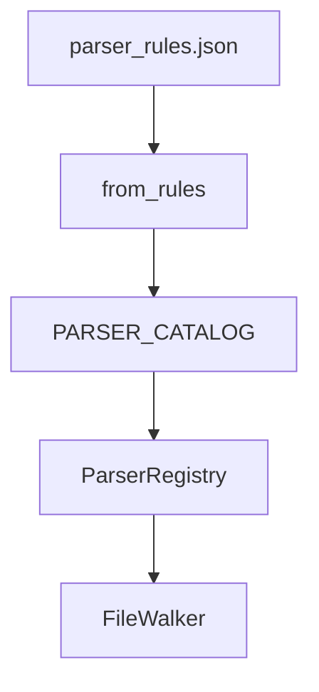

# LLD Chapter 01: Design Patterns Catalog

This chapter details the software design patterns used in the Drishti codebase to ensure extensibility, loose coupling, and clean separation of concerns.

---

## Table of Contents

1. [Strategy Pattern: Ingestion Parsers](#1-strategy-pattern-ingestion-parsers)
2. [Registry Pattern: Parser Registry](#2-registry-pattern-parser-registry)
3. [Factory Pattern: LLM Clients](#3-factory-pattern-llm-clients)
4. [Singleton Pattern: Database Clients](#4-singleton-pattern-database-clients)
5. [Observer & SSE Streaming Pattern](#5-observer--sse-streaming-pattern)

---

## 1. Strategy Pattern: Ingestion Parsers

### Intent
Define a family of algorithms (parsers), encapsulate each one, and make them interchangeable. The strategy pattern allows the ingestion engine to parse different file formats (Python, Java, PDFs, Markdown) using a unified interface.

```
                  ┌──────────────────────┐
                  │   AbstractParser     │
                  └──────────┬───────────┘
                             │
       ┌─────────────────────┼─────────────────────┐
       ▼                     ▼                     ▼
┌──────────────┐      ┌──────────────┐      ┌──────────────┐
│  ASTParser   │      │  PDFParser   │      │  MDParser    │
└──────────────┘      └──────────────┘      └──────────────┘
```

### Implementation Blueprint
```python
from abc import ABC, abstractmethod
from typing import List
from drishti.api.schemas import UniversalChunk

class BaseParser(ABC):
    """
    Abstract Strategy defining the contract for all document
    and code parsers.
    """
    
    @abstractmethod
    def parse(self, file_content: bytes, file_path: str) -> List[UniversalChunk]:
        """
        Parses raw file bytes and outputs a list of structured chunks.
        
        Args:
            file_content: Raw file contents in bytes.
            file_path: The relative file path in the workspace.
        """
        pass
```

---

## 2. Registry Pattern: Parser Registry

### Intent
Decouple the selection of parsers from the execution logic. Instead of writing long `if-elif-else` checks in the ingestion loop, parsers register themselves against file extension matchers, and a central registry retrieves the correct strategy automatically.

### As-Built Implementation

Production parsers are declared in `PARSER_CATALOG` and wired by `create_default_parser_registry()`:

```python
# ingestion/ast/catalog.py (excerpt)
PARSER_CATALOG: tuple[tuple[tuple[str, ...], ParserFactory], ...] = (
    ((".py", ".pyi", ".pyw"), _python_factory),
    ((".java",), _java_factory),
    ((".js", ".jsx", ".mjs", ".cjs"), _javascript_factory),
    ((".ts",), _typescript_factory),
    ((".tsx",), _tsx_factory),
    ((".go",), _go_factory),
)

def create_default_parser_registry() -> ParserRegistry:
    registry = ParserRegistry()
    rules = load_parser_rules()
    for extensions, factory in PARSER_CATALOG:
        parser = factory(rules)
        for extension in extensions:
            registry.register(extension, parser)
    return registry
```



### Implementation Blueprint (interface)
```python
from drishti.ingestion.base import BaseParser, ParserRegistry

class ParserRegistry:
    def register(self, extension: str, parser: BaseParser) -> None: ...
    def get_parser(self, file_path: str) -> BaseParser: ...
    def registered_extensions(self) -> frozenset[str]: ...
```

---

## 3. Factory Pattern: LLM Clients

### Intent
Provide an interface for creating families of related or dependent objects without specifying their concrete classes. We use the Factory pattern to instantiate LLM clients (Claude, GPT-4, Mock) depending on settings configuration.

### Implementation Blueprint
```python
from abc import ABC, abstractmethod
from typing import Generator

class BaseLLMClient(ABC):
    @abstractmethod
    def generate(self, prompt: str, system_prompt: str) -> str:
        pass
        
    @abstractmethod
    def stream_generate(self, prompt: str, system_prompt: str) -> Generator[str, None, None]:
        pass

class LLMClientFactory:
    """
    Factory to instantiate LLM wrappers based on configuration.
    """
    
    @staticmethod
    def get_client(provider: str, api_key: str) -> BaseLLMClient:
        provider = provider.lower()
        if provider == "anthropic":
            from drishti.generation.llm import AnthropicChatLLM
            return AnthropicChatLLM(api_key=api_key, model="claude-sonnet-4-20250514")
        elif provider == "openai":
            from drishti.generation.llm import OpenAIChatLLM
            return OpenAIChatLLM(api_key=api_key, model="gpt-4o-mini")
        elif provider == "mock":
            from drishti.generation.llm import MockChatLLM
            return MockChatLLM()
        else:
            raise ValueError(f"Unsupported LLM provider: {provider}")
```

---

## 4. Singleton Pattern: Database Clients

### Intent
Ensure a class has only one instance and provide a global point of access to it. We use the Singleton pattern for Qdrant, Neo4j, and Redis database connections to prevent connection pool exhaustion.

### Implementation Blueprint
```python
from qdrant_client import QdrantClient
from drishti.config import settings

class QdrantClientSingleton:
    """
    Singleton connection manager for Qdrant DB.
    """
    _instance: QdrantClient = None
    
    @classmethod
    def get_client(cls) -> QdrantClient:
        if cls._instance is None:
            cls._instance = QdrantClient(
                url=settings.QDRANT_URL,
                api_key=settings.QDRANT_API_KEY
            )
        return cls._instance
```

---

## 5. Observer & SSE Streaming Pattern

### Intent
FastAPI streams tokens from the LLM generator using Server-Sent Events (SSE). The streaming controller acts as an observer, forwarding tokens directly to the client socket as they arrive from the Anthropic SDK thread.

```
┌──────────────┐       ┌──────────────┐       ┌──────────────┐
│  Claude SDK  │ ───▶  │  FastAPI     │ ───▶  │  Web Client  │
│  (Token)     │       │  Controller  │       │  (SSE Stream)│
└──────────────┘       └──────────────┘       └──────────────┘
```

This prevents the backend from blocking resources while waiting for generation to complete, ensuring scalability.
