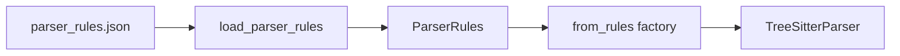

# LLD Chapter 03: AST-Aware Chunking Strategies

This chapter details the design of the core parser engine, comparing AST-aware syntax chunking against standard length-based strategies.

---

## Table of Contents

1. [Naive vs. AST-Aware Chunking](#1-naive-vs-ast-aware-chunking)
2. [Tree-sitter Parsing Mechanics](#2-tree-sitter-parsing-mechanics)
3. [Language-Specific AST Handlers](#3-language-specific-ast-handlers)
4. [Universal Chunker & Metadata Enrichment](#4-universal-chunker--metadata-enrichment)
5. [Code Implementation Blueprint](#5-code-implementation-blueprint)

---

## 1. Naive vs. AST-Aware Chunking

### Naive Chunking (Traditional RAG)
Traditional RAG splits documents using character limits or token counts (e.g., splitting every 500 characters with a 50-character overlap). While simple, this destroys code structure:
* **Function Splitting**: A single function may be split across two chunks, leaving the signature in Chunk A and the implementation details in Chunk B.
* **Loss of Scope**: Inner logic is detached from its class declaration and import contexts, leaving the LLM unable to trace variables.
* **Incoherent Context**: Searches return unrelated code snippets, causing model confusion and hallucinations.

### AST-Aware Chunking (Drishti)
Drishti parses code into an Abstract Syntax Tree (AST) using **Tree-sitter**. It extracts syntactically complete nodes (classes, interfaces, methods) as individual chunks:
* **Syntax Integrity**: Every function, method, or class remains complete within a single chunk boundary.
* **Hierarchy Scope**: Chunks are enriched with their parent context (e.g., nesting method names, parent class names, and namespace package paths).
* **High Retrieval Precision**: Matches return clean, functional code blocks, improving LLM response quality.

---

## 2. Tree-sitter Parsing Mechanics

Tree-sitter converts source file bytes into a syntax tree. The `BaseASTParser` traverses this tree, evaluating node types.

```
       Source File Bytes
               │
               ▼
   Concrete Syntax Tree (CST)
               │
       [Query S-Expressions]
               │
               ▼
   Extracted Syntax Nodes
(ClassDeclaration, MethodDeclaration)
```

We execute **Tree-sitter Queries** (written in S-expression syntax) to target specific structural blocks. This allows us to search the entire syntax tree for declarations in one pass.

---

## 3. Language-Specific AST Handlers

Drishti provides specific AST query maps for major languages:

### A. Python (`python`)
* **Extracted Nodes**: `class_definition`, `function_definition`.
* **Metadata**: Decorators, parameter lists, base classes.
* **Query Matcher**:
  ```scheme
  (class_definition
    name: (identifier) @class_name) @class_node
  (function_definition
    name: (identifier) @func_name) @func_node
  ```

### B. Java (`java`)
* **Extracted Nodes**: `class_declaration`, `interface_declaration`, `method_declaration`.
* **Metadata**: Return type, access modifiers, parameters, thrown exceptions.
* **Query Matcher**:
  ```scheme
  (class_declaration
    name: (identifier) @class_name) @class_node
  (method_declaration
    type: (type_identifier) @ret_type
    name: (identifier) @method_name) @method_node
  ```

### C. TypeScript/JavaScript (`typescript`, `javascript`)
* **Extracted Nodes**: `class_declaration`, `method_definition`, `function_declaration`, `lexical_declaration` (arrow functions).
* **Metadata**: Export statements, parameters, type annotations.

### D. Go (`go`)
* **Extracted Nodes**: `type_spec` (structs, interfaces), `function_declaration`, `method_declaration`.
* **Metadata**: Receiver types, parameters, return parameters.

---

## 4. Rule Engine & Metadata Enrichment

### A. Configurable extraction rules (US-03.06 — implemented)

`parser_rules.json` drives per-language settings:

| Setting | Purpose |
|---------|---------|
| `query` | Packaged `.scm` filename |
| `min_chunk_lines` | Skip **nested** symbols shorter than N lines |



Implementation: `ingestion/ast/rules.py`, `ingestion/ast/catalog.py`.

### B. Minimum chunk filter (implemented)

`TreeSitterParser._should_emit_chunk` drops nested symbols below the threshold while preserving short top-level declarations (type aliases, packages).

### C. Metadata enrichment (US-03.07–03.09)

`ingestion/ast/metadata.py` (see [Universal Chunk Schema](../design/universal-chunk-schema.md)) attaches:

1. **Docstring** — Python body strings; leading comments / Javadoc elsewhere.
2. **Parameters & return type** — Tree-sitter `parameters` / `return_type` fields.
3. **Cyclomatic complexity** — McCabe count over symbol body AST.
4. **Context path** — `file_path::ParentClass::symbol` for retrieval tracing.
5. **Import symbols** — per-file import lists; `SymbolTable` maps names → defining paths.

### D. Line range

Start and end lines are **1-indexed**; `end_line` is **inclusive** (`TreeSitterParser._inclusive_end_line`).

---

## 5. As-Built Module Map

| Module | Role |
|--------|------|
| `ingestion/ast/base.py` | `TreeSitterParser` — queries, chunk build, filters |
| `ingestion/ast/catalog.py` | `PARSER_CATALOG` production factories |
| `ingestion/ast/metadata.py` | Enrichment helpers (US-03.07+) |
| `ingestion/ast/rules.py` | JSON rule loader |
| `ingestion/symbols.py` | `SymbolTable` cross-file resolution |
| `ingestion/queries/*.scm` | Tree-sitter capture definitions |

Detailed diagrams: [architecture/as-built-code-ingestion.md](../architecture/as-built-code-ingestion.md).

---

## 6. Code Implementation Blueprint (Reference)

The following classes illustrate the core AST parsing interface (simplified from early design):

```python
from typing import List, Dict, Any
from tree_sitter import Language, Parser, Tree
from drishti.ingestion.base import BaseParser
from drishti.api.schemas import UniversalChunk

class ASTParser(BaseParser):
    """
    Language-agnostic AST parser wrapper that leverages Tree-sitter.
    """
    
    def __init__(self, language_name: str, library_path: str, query_scm: str):
        self.language = Language(library_path, language_name)
        self.parser = Parser()
        self.parser.set_language(self.language)
        self.query = self.language.query(query_scm)
        
    def parse(self, file_content: bytes, file_path: str) -> List[UniversalChunk]:
        """
        Parses code, executes tree query matching, and extracts chunks.
        """
        tree: Tree = self.parser.parse(file_content)
        captures = self.query.captures(tree.root_node)
        
        chunks = []
        
        for node, capture_name in captures:
            # We filter matches based on targeted captures
            if capture_name in ["class_node", "method_node", "func_node"]:
                start_byte = node.start_byte
                end_byte = node.end_byte
                start_point = node.start_point
                end_point = node.end_point
                
                content = file_content[start_byte:end_byte].decode("utf-8", errors="ignore")
                
                chunk = UniversalChunk(
                    id=self._generate_uuid(),
                    source_id="active_commit",
                    content=content,
                    content_type="code",
                    file_path=file_path,
                    source_type="git_repo",
                    language=self.language_name,
                    start_line=start_point[0] + 1,
                    end_line=end_point[0] + 1,
                    node_type=node.type,
                    name=self._extract_node_name(node),
                    parent_class=self._find_parent_class(node)
                )
                chunks.append(chunk)
                
        return chunks

    def _extract_node_name(self, node) -> str:
        # Traverses child nodes to find identifiers
        for child in node.children:
            if child.type == "identifier":
                return child.text.decode("utf-8")
        return "anonymous"

    def _find_parent_class(self, node) -> str | None:
        # Traverses parent nodes to find enclosing classes
        current = node.parent
        while current is not None:
            if current.type in ["class_declaration", "class_definition"]:
                return self._extract_node_name(current)
            current = current.parent
        return None
```
