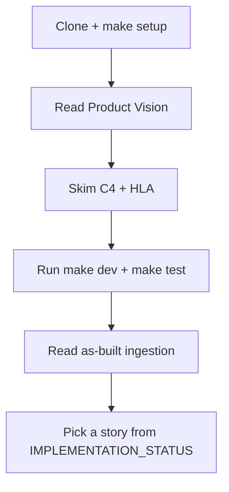

# Onboarding Guide

Welcome to Drishti. This guide routes new contributors to the right documentation in under 30 minutes.

---

## 30-Minute Path

| Step | Time | Resource |
|------|------|----------|
| 1. Environment | 10 min | [README § Quick Start](../../README.md#quick-start), [operations](../operations/README.md) |
| 2. Why we exist | 5 min | [Product Vision](../product/PRODUCT-VISION.md) |
| 3. System shape | 10 min | [C4 Model](../architecture/c4-model.md), [HLA](../architecture/high-level-architecture.md) |
| 4. Code path | 10 min | [As-built ingestion](../architecture/as-built-code-ingestion.md) |
| 5. Contribute | 5 min | [CONTRIBUTING.md](../../CONTRIBUTING.md), [IMPLEMENTATION_STATUS](../IMPLEMENTATION_STATUS.md) |

---

## Role-Based Tracks

### Backend Engineer (Ingestion)

1. [As-built code ingestion](../architecture/as-built-code-ingestion.md)
2. [LLD Chapter 03 — Chunking](../lld/03-chunking-strategies.md)
3. [Deep-dive: Tree-sitter](../deep-dives/01-tree-sitter-internals.md)
4. Source: `src/drishti/ingestion/`

### Backend Engineer (Search / RAG)

1. [LLD Chapter 04 — Search pipeline](../lld/04-search-pipeline.md)
2. [Deep-dive: Hybrid search](../deep-dives/03-hybrid-search-mechanics.md)
3. [ADR-004 Qdrant](../adr/ADR-004-qdrant-vector-database.md)

### ML / Evaluation

1. [Evaluation README](../evaluation/README.md)
2. [Deep-dive: RAG evaluation](../deep-dives/05-rag-evaluation-science.md)
3. `benchmarks/datasets/golden_qa.json`

### Interview Prep

1. [LLD Index](../lld/README.md) — priority chapters marked 🔥
2. [ADR Index](../adr/README.md) — all 10 decisions
3. [Deep-dives Index](../deep-dives/README.md)

---

## AI Assistant Context

Agents should read **[AGENTS.md](../../AGENTS.md)** before editing code. Documentation changes should update `IMPLEMENTATION_STATUS.md` when story status changes.

---

## Questions?

- Architecture: [architecture/README.md](../architecture/README.md)
- API shapes: [design/api-contracts.md](../design/api-contracts.md)
- Status: [IMPLEMENTATION_STATUS.md](../IMPLEMENTATION_STATUS.md)
