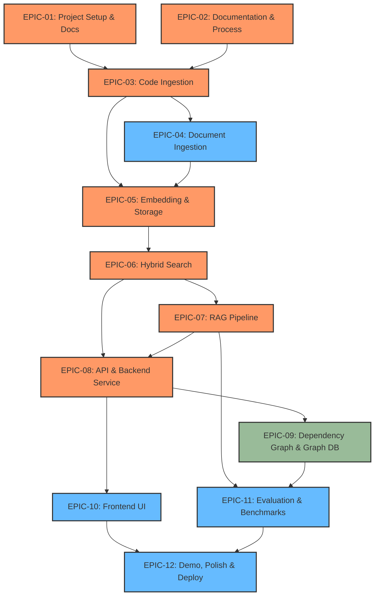

# Epics Overview & Roadmap: Drishti (दृष्टि)

This document provides a comprehensive map of all 12 epics defining the implementation plan for Drishti. It details the work breakdown, estimated story points, priority, and dependency graph.

---

## Table of Contents

1. [Epic Dependency Graph](#1-epic-dependency-graph)
2. [Epic Breakdown Table](#2-epic-breakdown-table)
3. [Phased Implementation Roadmap](#3-phased-implementation-roadmap)
4. [Cross-Epic Quality Standards](#4-cross-epic-quality-standards)

---

## 1. Epic Dependency Graph

The dependencies between epics represent the logical build order. Foundation epics must be established before ingestion, and search capability must precede generation.

---

## 2. Epic Breakdown Table

The estimation follows standard Fibonacci story points (1, 2, 3, 5, 8, 13) where 1 point represents a trivial task (e.g., adding an environment variable) and 13 represents a complex, multi-day component build.

| Epic Code | Epic Title | Priority | Est. Points | Core Component / Target | Status |
|-----------|------------|----------|-------------|-------------------------|--------|
| **[EPIC-01](file:///Users/abhishek/Dev/Drishti/docs/product/epics/EPIC-01.md)** | Project Setup & Documentation | P0 | 21 | Scaffold, Docker, CI/CD, Makefile | 🟩 Done |
| **[EPIC-02](file:///Users/abhishek/Dev/Drishti/docs/product/epics/EPIC-02.md)** | Documentation & Process | P0 | 34 | ADRs, HLA, Vision, LLD | 🟨 In Progress |
| **[EPIC-03](file:///Users/abhishek/Dev/Drishti/docs/product/epics/EPIC-03.md)** | Code Ingestion Pipeline | P0 | 55 | Tree-sitter parsers, AST extraction | 🔮 Planned |
| **[EPIC-04](file:///Users/abhishek/Dev/Drishti/docs/product/epics/EPIC-04.md)** | Document Ingestion Pipeline | P1 | 42 | PDF layouts, Markdown headings, Vision | 🔮 Planned |
| **[EPIC-05](file:///Users/abhishek/Dev/Drishti/docs/product/epics/EPIC-05.md)** | Embedding & Vector Storage | P0 | 34 | OpenAI & BM25 embeddings, Qdrant | 🔮 Planned |
| **[EPIC-06](file:///Users/abhishek/Dev/Drishti/docs/product/epics/EPIC-06.md)** | Hybrid Search Engine | P0 | 55 | RRF fusion, Cohere re-ranking | 🔮 Planned |
| **[EPIC-07](file:///Users/abhishek/Dev/Drishti/docs/product/epics/EPIC-07.md)** | RAG Pipeline & Generation | P0 | 42 | Context builder, LLM integration, Citations | 🔮 Planned |
| **[EPIC-08](file:///Users/abhishek/Dev/Drishti/docs/product/epics/EPIC-08.md)** | API & Backend Service | P0 | 34 | FastAPI routing, validation schemas | 🔮 Planned |
| **[EPIC-09](file:///Users/abhishek/Dev/Drishti/docs/product/epics/EPIC-09.md)** | Dependency Graph & Impact Analysis | P2 | 34 | Neo4j graph, import extraction | 🔮 Planned |
| **[EPIC-10](file:///Users/abhishek/Dev/Drishti/docs/product/epics/EPIC-10.md)** | Frontend UI | P1 | 55 | Next.js app, Monaco Editor, citation UI | 🔮 Planned |
| **[EPIC-11](file:///Users/abhishek/Dev/Drishti/docs/product/epics/EPIC-11.md)** | Evaluation & Benchmarking | P1 | 34 | Golden Q&A, RAGAS execution, benchmarks | 🔮 Planned |
| **[EPIC-12](file:///Users/abhishek/Dev/Drishti/docs/product/epics/EPIC-12.md)** | Demo, Polish & Deployment | P1 | 21 | Docker optimization, seed script, docs | 🔮 Planned |
| **Total** | | | **461 SP** | | |

---

## 3. Phased Implementation Roadmap

Work is scheduled across six progressive build phases:

### Phase 1: Foundation (Epics 01–02)
* **Objective**: Build a rock-solid, production-grade project scaffold with all plans, guidelines, and documentation approved.
* **Outputs**: Full workspace setup, CI workflows, docker-compose, and all design documents.

### Phase 2: Ingestion & Storage (Epics 03–05)
* **Objective**: Build the multi-modal parser engine to convert raw files into structured syntax trees and paragraph layouts, embedding them into Qdrant.
* **Outputs**: Tree-sitter parsers, layout-aware PDF extraction, dense+sparse vector database collections.

### Phase 3: Search & Generation (Epics 06–08)
* **Objective**: Construct the core RAG runtime—retrieving chunks, combining sparse/dense scores, re-ranking via Cohere, and generating streaming LLM answers.
* **Outputs**: Hybrid search algorithm, context builder, citation generation, streaming FastAPI router.

### Phase 4: Frontend UI & Advanced Traversal (Epics 09–10)
* **Objective**: Create the Next.js visual interface incorporating code highlighting, citations, and interactive dependency visualization (optionally using Neo4j).
* **Outputs**: Modern Web UI, Monaco Editor integrations, dependency mapping.

### Phase 5: Evaluation & Science (Epic 11)
* **Objective**: Run automated quality frameworks against a golden Q&A dataset to calculate precision, recall, and faithfulness.
* **Outputs**: Metrics reporting CLI, automated regression alerts, comparison charts.

### Phase 6: Polish & Deployment (Epic 12)
* **Objective**: Final package optimization, seeding script execution, deployment staging.
* **Outputs**: Docker production images, interactive seed scripts, public walkthroughs.

---

## 4. Cross-Epic Quality Standards

Every user story built must adhere to the quality standards defined in our [AGENTS.md](file:///Users/abhishek/Dev/Drishti/AGENTS.md) guide:
1. **100% Type Annotations**: Checked via `mypy`.
2. **Comprehensive Coverage**: Unit tests must cover all logic, with mock integrations.
3. **Structured Commits**: Commits must follow conventional format: `feat(scope): message`.
4. **Link Integrations**: Any new source code file must be linked in `docs/IMPLEMENTATION_STATUS.md`.
