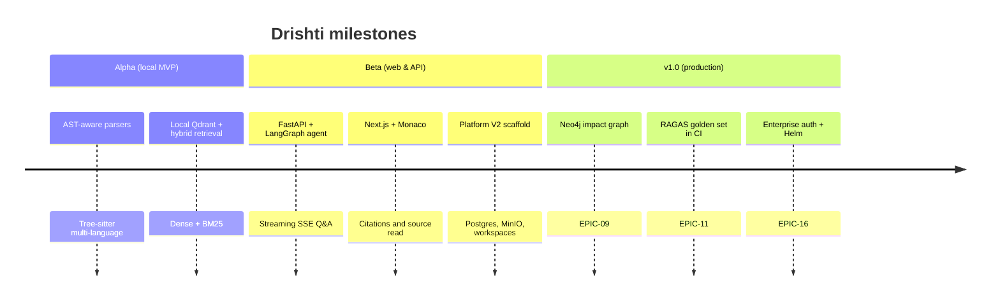

# Release Plan: Drishti (दृष्टि)

This release plan outlines the progression of Drishti from initial developer preview (Alpha) to public beta and final production-ready v1.0.

---

## Table of Contents

1. [Phased Release Overview](#1-phased-release-overview)
2. [Alpha Release: Developer Preview](#2-alpha-release-developer-preview)
3. [Beta Release: Web Interface & API Integration](#3-beta-release-web-interface--api-integration)
4. [v1.0 Release: Enterprise Readiness & Evaluation](#4-v10-release-enterprise-readiness--quad-evaluation)
5. [Release Quality Checklist](#5-release-quality-checklist)

---

## 1. Phased Release Overview

The Drishti release cycle is split into three milestones designed to systematically derisk components.

---

## 2. Alpha Release: Developer Preview

* **Objective**: Establish the core ingestion, parsing, and vector search pipelines. Accessible via terminal CLI.
* **Target Date**: End of Phase 2
* **Target Audience**: Internal developer testing, early feedback.
* **Key Features**:
  * Language-aware parser registry (Tree-sitter) support for Python, JavaScript/TypeScript, Java, and Go.
  * Layout-aware PDF and Markdown parser.
  * Local docker-compose running Qdrant and Redis.
  * CLI tool (`scripts/drishti-cli`) for ingesting a repository and asking questions.
* **Exit Criteria**:
  * > 90% parsing accuracy on complex syntax files.
  * Successful ingestion of a 100-file repository in under 2 minutes.
  * CLI successfully returns exact matching code lines for query symbols.

---

## 3. Beta Release: Web Interface & API Integration

* **Objective**: Expose functionality via high-performance REST APIs and a sleek, developer-friendly web UI.
* **Target Date**: End of Phase 4
* **Target Audience**: Early adopters, software development teams.
* **Key Features**:
  * FastAPI server running on Docker with CORS, rate-limiting, and connection pool configurations.
  * Unified `/api/v1/ingest`, `/api/v1/search`, and `/api/v1/ask` endpoints.
  * Hybrid search engine combining Qdrant dense vector search with sparse BM25 search.
  * Cohere rerank v3 integration.
  * Streaming responses with markdown formatting and citation highlights.
  * Next.js web application with a code editor panel (Monaco Editor) highlighting exact file-lines on citation clicks.
* **Exit Criteria**:
  * API latency under 200ms for search, and first-token generation latency under 1.5s.
  * Successful interactive citation click-throughs from chat to Monaco Editor.
  * No memory leaks identified over a 24-hour load test.

---

## 4. v1.0 Release: Enterprise Readiness

* **Objective**: Finalize advanced analytical capabilities, run extensive RAG quality evaluations, optimize performance, and document production deployments.
* **Target Date**: End of Phase 6
* **Target Audience**: General public, enterprise teams.
* **Key Features**:
  * Dependency Graph integration (Neo4j) mapping imports, definitions, and class relationships.
  * Automated impact analysis via `/api/v1/impact-analysis` endpoint.
  * Full evaluation framework using RAGAS, computing context recall, context precision, and faithfulness.
  * GOLDEN Q&A dataset containing 100+ curated code/doc questions and ground truth.
  * Benchmarking dashboard comparing AST-aware chunking against naive chunking.
  * Production Docker images and Kubernetes/Helm charts.
* **Exit Criteria**:
  * RAGAS Context Recall > 90% and Faithfulness > 95% across the Golden Q&A dataset.
  * Sub-second query execution times on repositories up to 5,000 files.
  * Fully green CI/CD pipelines including linting, security audits (`bandit`), and type checking.

---

## 5. Release Quality Checklist

Before any milestone is signed off, the following gates must be cleared:

1. **Test Coverage**: Minimum of 85% branch coverage on core logic (`tests/unit` + `tests/integration`).
2. **Type Safety**: No errors returned by `mypy` running in strict mode.
3. **Linting**: Code formatted and linted cleanly via `ruff format` and `ruff check`.
4. **Documentation**: All new modules must have docstrings, and their status updated in `docs/IMPLEMENTATION_STATUS.md`.
